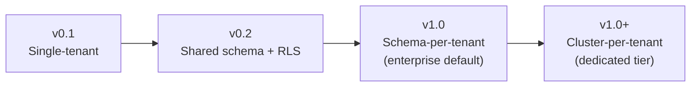

# ADR 0006: Multi-Tenancy Model — Single-Tenant for v0.1, Shared Schema with Tenant ID for v0.2, Schema-per-Tenant Path for Enterprise

- **Status**: Proposed
- **Date**: 2026-05-05
- **Deciders**: The Plynf Authors

## Context

Plynf's v0.1 is single-tenant: one running cluster serves one user/org. This is fine for a PoC running on a developer's laptop, and inadequate for any commercial use. The multi-tenancy model determines:

- The blast radius of a bug or compromise (does tenant A see tenant B's data?)
- The operational footprint (one cluster per tenant vs. many tenants per cluster)
- The cost shape per tenant (shared infrastructure vs. dedicated)
- The upgrade story (do migrations run once or per tenant?)
- The compliance story (auditors care a great deal about isolation strength)

The standard models for multi-tenant SaaS, from cheapest/most-shared to most-expensive/most-isolated:

1. **Shared schema.** Every table has a `tenant_id` column; queries filter by it. Postgres' Row-Level Security (RLS) can enforce. Dirt cheap, fastest to ship, weakest isolation.
2. **Schema per tenant.** Each tenant gets its own schema (`tenant_xyz.workspaces`, etc.). Stronger isolation; per-tenant migrations; manageable up to ~hundreds of tenants per database.
3. **Database per tenant.** Each tenant gets its own database in the same cluster. Stronger still; harder to operate; has scale limits.
4. **Cluster per tenant.** Each tenant gets dedicated services and storage. Maximum isolation; highest cost; the "enterprise" tier.

Plynf's specific data shape complicates this:

- **Workspace data is the hot path.** KV reads, file reads, snapshot capture. Filter performance matters.
- **Audit log is high-write.** Every tool call appends a row. Index pressure and partition pressure rise quickly.
- **Blob storage is volume-dominated.** Tenancy here is about object-key prefixing or bucket-per-tenant.
- **Capability tokens (post-v0.2 per arch doc 06) carry tenant identity.** The verifier needs the tenant context to resolve scopes.

## Decision

Plynf adopts a **tiered multi-tenancy model**, evolving through three stages:

### v0.1: Single-tenant
One cluster, one tenant, no `tenant_id` columns. Documented as "PoC only, do not deploy multi-tenant".

### v0.2: Shared schema with `tenant_id` and Postgres RLS
- Every business table gains a `tenant_id` column. Schema migration adds it as `NOT NULL` with a default during the transition window; existing rows get the singleton tenant ID.
- All queries filter by `tenant_id`. Application code passes a tenant context through repositories. We do not allow ad-hoc SQL that bypasses this.
- **Postgres Row-Level Security policies** enforce filtering at the DB layer as a defense-in-depth measure. The application sets `SET LOCAL plinth.tenant_id = '...'` per request; RLS policies use it.
- Indexes are tenant-prefixed: `(tenant_id, workspace_id, key)` rather than `(workspace_id, key)`.
- Blob storage uses keys prefixed with tenant: `tenants/<tenant_id>/blobs/<sha256>` in a single bucket.
- Cache and audit tables follow the same pattern.

### v1.0: Schema-per-tenant for enterprise tier
- Mid-market and enterprise customers get their own Postgres schema (and optionally their own object-storage bucket).
- The tenant→schema mapping lives in a small "control plane" table. Application code routes to the right schema per request.
- Hot-path queries become un-prefixed within the tenant schema, recovering some performance.
- Per-tenant Postgres roles are possible, allowing the application to connect with reduced privileges per tenant — strong defense in depth.

### v1.0+: Cluster-per-tenant for regulated / dedicated
- Optional offering for customers with hard isolation requirements (HIPAA, defense, government).
- Plynf services + Postgres + S3 bucket all dedicated.
- Operationally expensive, priced accordingly.

The progression is one-way: a tenant promoted to a higher isolation tier doesn't go back. Migration tooling between tiers is part of the v1.0 deliverables.

## Consequences

### Positive

- **The cheapest tier is online by v0.2.** We can serve real customers shortly after the v0.1 PoC, with isolation strong enough for early-stage adopters.
- **Defense in depth via RLS.** A bug in application code that forgets a `WHERE tenant_id = ?` clause is caught by Postgres at the row-policy layer. This is genuinely valuable; many shared-schema systems get this wrong.
- **Clear upgrade path.** Customers who outgrow shared-schema isolation can migrate to schema-per-tenant without changing their integration. The Plynf API is stable across the tiers.
- **Cost-pricing alignment.** Lighter tiers cost less to operate, are priced lower; higher tiers cost more, priced for enterprise. We're not promising one-size-fits-all.
- **Enterprise compliance story.** Schema-per-tenant and cluster-per-tenant tiers give us answers to SOC2 / ISO27001 / FedRAMP audits we'd struggle to give from shared-schema alone.

### Negative / Trade-offs

- **Shared-schema's "noisy neighbor" risk.** A tenant with millions of audit events affects index performance for everyone in the same schema. Mitigated by per-tenant table partitioning at v0.3 and by promoting heavy users to schema-per-tenant.
- **RLS overhead.** Postgres RLS is well-engineered but does cost a few percent of query latency. Acceptable; the safety pays for itself.
- **Schema-per-tenant scale ceiling.** Postgres handles low thousands of schemas in a single database before catalog operations slow noticeably. A customer base in the tens of thousands of tenants needs sharding across multiple databases. We accept this constraint and plan database-sharding work for v1.0+.
- **Migration complexity at every tier transition.** Promoting a tenant from shared schema to its own schema involves data movement and a brief read-only window. The same applies for schema-to-cluster. We'll script it but it's never fully painless.
- **Operational complexity grows monotonically.** Single-tenant is easy. Shared-schema with RLS is medium. Schema-per-tenant means per-tenant schema migrations. Cluster-per-tenant means a fleet of small clusters. Honest about the operational tax we're signing up for.
- **The `tenant_id` column adds work to every query.** The application has to thread a tenant context through every code path. Easy to get wrong in early v0.2; the RLS net is the safety we rely on while we mature the practice.

## Alternatives Considered

### Cluster-per-tenant from day one

Maximum isolation; no shared-state risks; conceptually simple. Why we don't:

- Operationally untenable for early-stage customers. A free trial costs us a full Plynf cluster's worth of resources.
- We can't compete on price with shared-schema offerings if every tenant gets their own infrastructure.
- The right answer for *some* customers, not for the default.

### Database-per-tenant in the same cluster

Stronger isolation than schema-per-tenant; weaker than cluster-per-tenant. The case for:

- Postgres' database boundary is firmer than its schema boundary (cross-database queries are explicit, easier to audit).
- Per-tenant `pg_dump` / restore is trivial.

The case against:

- Postgres has scale ceilings on databases-per-cluster too (~hundreds), similar to schema-per-tenant's catalog limits.
- Migrations and schema changes are per-database, just like schema-per-tenant.
- Connection pooling is harder (one pool per database vs. one pool per cluster with `SET search_path`).

We default to schema-per-tenant for enterprise instead because the operational story is slightly cleaner with `pgbouncer` / `pgcat`. We may add database-per-tenant as an additional tier if specific customers ask.

### SSPL-style isolation by separate processes

Run a separate workspace + gateway *process* per tenant on the same host. Considered. Rejected:

- The cold-start cost per tenant is too high; we want to scale to many small tenants.
- Process-level isolation isn't materially better than tenant-aware code with RLS for our threat model.
- Doesn't solve the data-store isolation problem, just the runtime layer.

### Shared schema *without* RLS

Just rely on application code filtering. Why we don't:

- Defense in depth. RLS catches bugs the application would otherwise emit silently.
- The performance cost of RLS is small.
- Some buyers (security-focused) explicitly ask whether RLS is on.

### Tenant-as-workspace (no separate tenant concept)

A tempting simplification: every workspace is a tenant. Why we don't:

- A real tenant typically has many workspaces (a research workspace, a coding workspace, a customer-support workspace per customer of theirs). They share auth, billing, audit views.
- Coupling the two means workspace deletion is tenant deletion, billing is per-workspace, and capability tokens scope per workspace. Lots of fallout, all of it bad.
- We keep them as separate concepts: a `tenant_id` on every business object, with workspaces nested under tenants.

## Notes / Links

- Capability tokens carry tenant identity: see [`docs/architecture/06-identity-capabilities.md`](../architecture/06-identity-capabilities.md) §2 (the `delegator` claim implies a tenant; v0.2 work explicitly adds `tenant_id` to the JWT).
- Storage decisions are the foundation: [ADR 0002](./0002-storage-postgres-and-objectstore.md). The Postgres choice is what makes RLS possible.
- Cost attribution depends on tenant identity in events: [`docs/architecture/05-observability.md`](../architecture/05-observability.md) §6.
- Production deployment shape: [`docs/architecture/01-system-overview.md`](../architecture/01-system-overview.md) §2.2.
- Operational runbook for tenant promotion (TODO, v1.0): `docs/operations/tenant-promotion.md`.
- We deliberately do not support cross-tenant resource sharing in v0.2. This is a v1.0+ enterprise feature with a separate ADR yet to be written.
