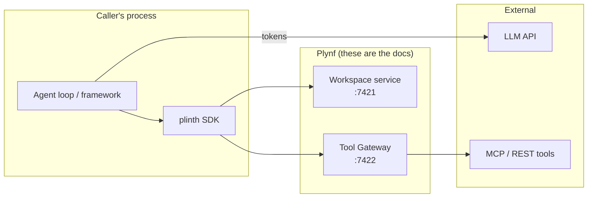
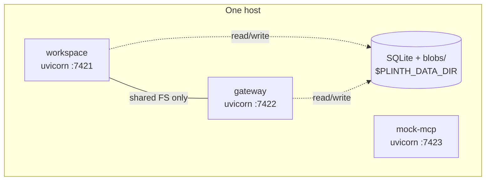
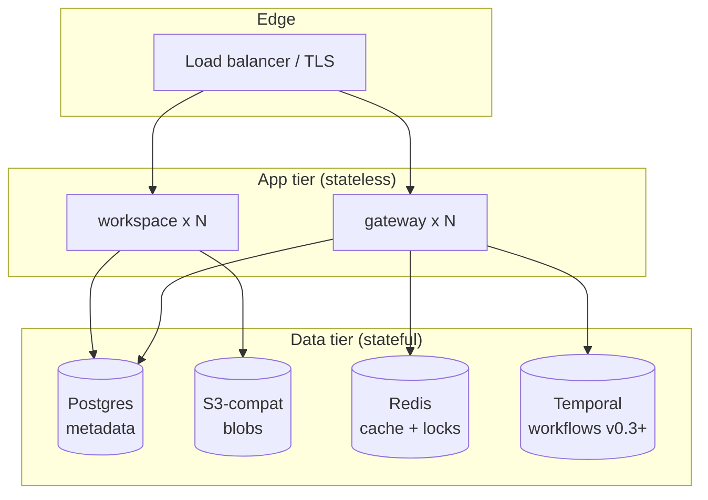
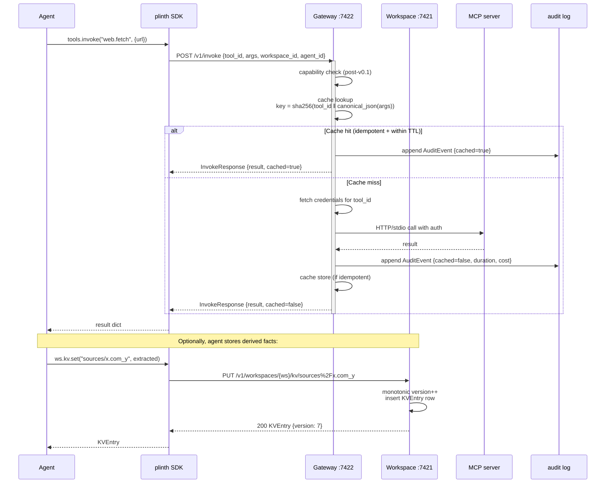
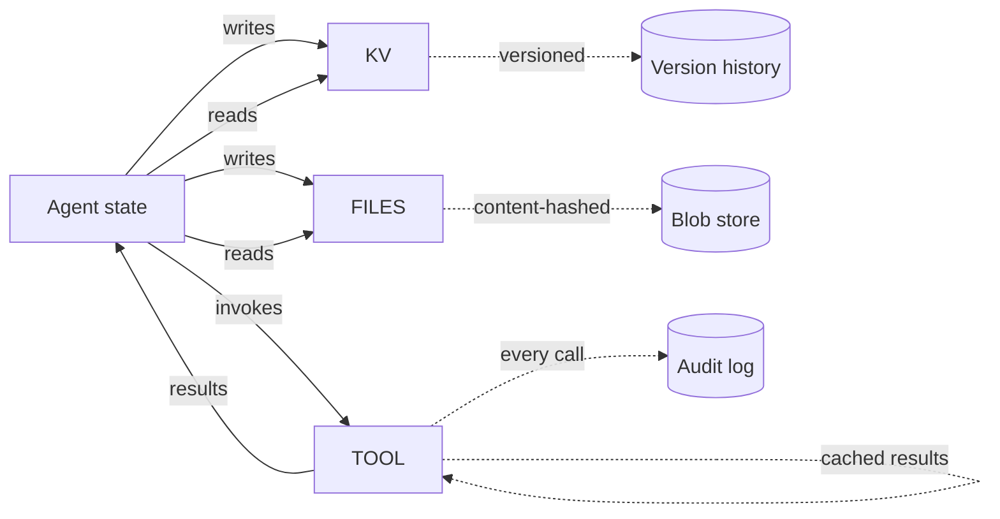

# 01 — System Overview

> **Why this exists.** This document is the map. It covers how the v0.1 services compose, where the isolation boundaries live, what happens during a single request, and how the same shape scales to a multi-node production cluster. Read this before any of the component-specific docs — they assume the topology described here.

## 1. Where Plynf sits in the stack

Plynf is **infrastructure that lives between the agent and the world**. It does not run the model. It does not own the orchestration loop. It owns the *substrate* the agent reads from and writes to, and the gateway every external action passes through.

Three things to internalise from this picture:

1. **The agent loop is not in Plynf.** Plynf is HTTP services. Frameworks like LangGraph, the OpenAI Agents SDK, or hand-rolled loops sit in front of it.
2. **The model API call does not go through Plynf.** Tokens go directly from the caller to the LLM. Plynf's value is in *how much state the caller has to put into those tokens* — which is where the 60%+ reduction comes from.
3. **The gateway, not the agent, talks to MCP servers.** Tool calls leave the agent process as a single `POST /v1/invoke` and re-enter as a JSON result. Caching, audit, and auth all happen on the server side of that boundary.

## 2. Deployment shapes

Plynf is designed to run in two materially different shapes. v0.1 ships only the first; v1.0 targets the second.

### 2.1 Single-node PoC (v0.1)

- Three independent processes, each a FastAPI app run by `uvicorn`.
- They share `$PLINTH_DATA_DIR` (default `/tmp/plinth-data`) but **no in-process state**, no shared memory, no IPC. The only thing crossing the process boundary inside the host is the filesystem.
- Each service owns its own SQLite DB: `workspace.db`, `gateway.db`. Blobs live under `blobs/` next to them.
- This shape is intentionally trivial: `make serve` brings it up, `make stop` tears it down, and `docker-compose.yml` packages the same three processes into containers.
- It runs offline — `mock-mcp` provides 5 tools whose `mock://` fixtures contain canned content, so demos work on a plane.

### 2.2 Production cluster (v1.0 target)

The shape that matters here is not the boxes but the **statefulness boundary**: workspace and gateway processes are stateless replicas. All durable state lives in Postgres / S3 / Redis. The promotion from v0.1 to this shape is therefore not a rewrite — it's a swap of the storage backend. ADR 0002 covers the data-tier choices; multi-tenancy choices are in ADR 0006.

## 3. Request flow — a single agent action end to end

Here is what happens when an agent issues `ctx.tools.invoke("web.fetch", {"url": "https://x.com/y"})`. This is the canonical shape of a Plynf request and is worth understanding precisely.

A few subtleties to call out, since they're load-bearing for the design:

- **Audit is in the hot path, not async.** Writes happen synchronously before the response. We pay the latency to guarantee no invocation is unrecorded. This is a deliberate trade vs. a logging fan-out.
- **The cache is checked on canonical-JSON arg hashing.** Argument key order, whitespace, and number representation are normalised before hashing. Otherwise `{"a":1,"b":2}` and `{"b":2,"a":1}` would miss each other. See `services/gateway/src/plinth_gateway/cache.py` (planned) for the hash function.
- **`workspace_id` is metadata only on `/v1/invoke`.** It does not authorize. It is recorded in the audit event so that "what tool calls did this workspace's agents make in the last hour" is a single SQL query.
- **The SDK does not retry by default.** If the gateway returns 5xx or the call times out, the SDK surfaces it. Retries are the agent loop's responsibility (which can be made safe with `idempotency_key` — see arch doc 03).

## 4. Data flow and isolation

The big-picture data flow is small enough to fit on one diagram:

### Isolation boundaries (v0.1)

| Boundary | What it isolates | How it's enforced |
|---|---|---|
| Process | Workspace vs gateway | Separate uvicorns, separate SQLite files |
| Workspace ID | One agent's state from another's | Path scoping `/v1/workspaces/{ws_id}/...` and SQL `WHERE workspace_id = ?` filters |
| Branch ID | Speculative state from main | `branch_id` column on KVEntry/FileEntry; reads fall through to base snapshot |
| Tool credentials | Per-tool auth, not per-agent | `auth_config` on Tool registration; gateway holds OAuth refresh tokens |

What is **not** isolated in v0.1, deliberately:
- **Tenants.** There is one logical tenant per running cluster. ADR 0006 covers the path forward.
- **Auth.** The bearer token is "any non-empty string". This will not survive contact with v0.2.
- **Resources.** No rate limits, no per-workspace quotas. A pathological agent can fill SQLite and the blob dir.

## 5. Failure modes per service

Honest failure mode analysis, because this is documentation engineers will use to debug things at 2am.

### Workspace service

| Failure | Symptom | What happens | Recovery |
|---|---|---|---|
| SQLite locked (concurrent writer) | 5xx with `database is locked` | Request fails | Retry; fix is WAL mode, already enabled |
| Disk full on `$PLINTH_DATA_DIR` | 5xx on PUTs to KV/files | Writes fail, reads still work | Operator clears space; consider GC (see doc 02) |
| Process restart mid-write | Partial blob with no metadata row | Orphan blob on disk | GC sweep reconciles `blobs/` against `file_entries` table |
| Corrupt SQLite | All requests fail | Full outage on this node | Restore from backup; v1.0 Postgres replication mitigates |

### Gateway service

| Failure | Symptom | What happens | Recovery |
|---|---|---|---|
| Backend MCP down | Per-tool 502/timeout | `/v1/invoke` returns error; cache untouched | Agent can retry; circuit-breaker is v0.2 |
| Cache DB corruption | Cache miss-storm; backend overload risk | Performance regression, not correctness | Drop the cache table; data is ephemeral |
| Audit write fails | 5xx on invoke | Invocation refused, *not* silently un-audited | Re-issue once audit is healthy. This is intentional — we'd rather fail closed than lose audit |
| OAuth refresh failure | 401 from backend | Tool returns auth error | Re-prompt user via consent flow (v0.2) |

### Mock-MCP

This is a development convenience, not a production service. If it crashes, only demos break. It has no persistent state worth recovering.

## 6. What you will *not* find in v0.1

- Distributed coordination. No leader election, no consensus. Nodes don't talk to each other.
- Real-time streaming. All endpoints are request/response. Server-Sent Events for tool streams is a v0.3 item once we have a realistic case for it.
- Multi-region. Single host, single timezone, single clock.
- An agent runtime. We are deliberately *not* in the orchestration business. The SDK is thin and the agent loop is the caller's.

## 7. Open questions / future directions

- **Should workspace and gateway eventually merge?** Today they're separate because their failure modes differ (workspace = data integrity, gateway = network reliability). At some scale this may flip — investigations here once we hit the 100-node-cluster-cluster mark.
- **In-process SDK fast path.** For embedded use cases (test fixtures, single-tenant lab environments) we could let the SDK call workspace logic in-process. Would short-circuit the HTTP hop. Saved for v0.4 once production deployments establish the dominant shape.
- **gRPC alternatives.** The OpenAPI surface is honest about HTTP/JSON. gRPC would help for high-fanout multi-agent scenarios. There are protos in `specs/proto/` — they're aspirational, not implemented.
- **Async / streaming returns from tools.** Long-running tools (a deep research that takes minutes) currently block. A poll-based contract is sketched in arch doc 03, but the right answer might be SSE plus durable workflows from arch doc 04.

For the *why*-decisions behind this topology, see ADRs 0001 (stack), 0002 (storage), 0006 (multi-tenancy). For the moving parts referenced here, drill into:

- [`02-workspace-design.md`](./02-workspace-design.md) — how versioning, branches, snapshots actually work
- [`03-tool-gateway-design.md`](./03-tool-gateway-design.md) — caching, audit, auth in detail
- [`04-coordination-primitives.md`](./04-coordination-primitives.md) — the v0.2 coordination layer
- [`05-observability.md`](./05-observability.md) — the v0.2 event plane
- [`06-identity-capabilities.md`](./06-identity-capabilities.md) — the v0.2 identity layer
