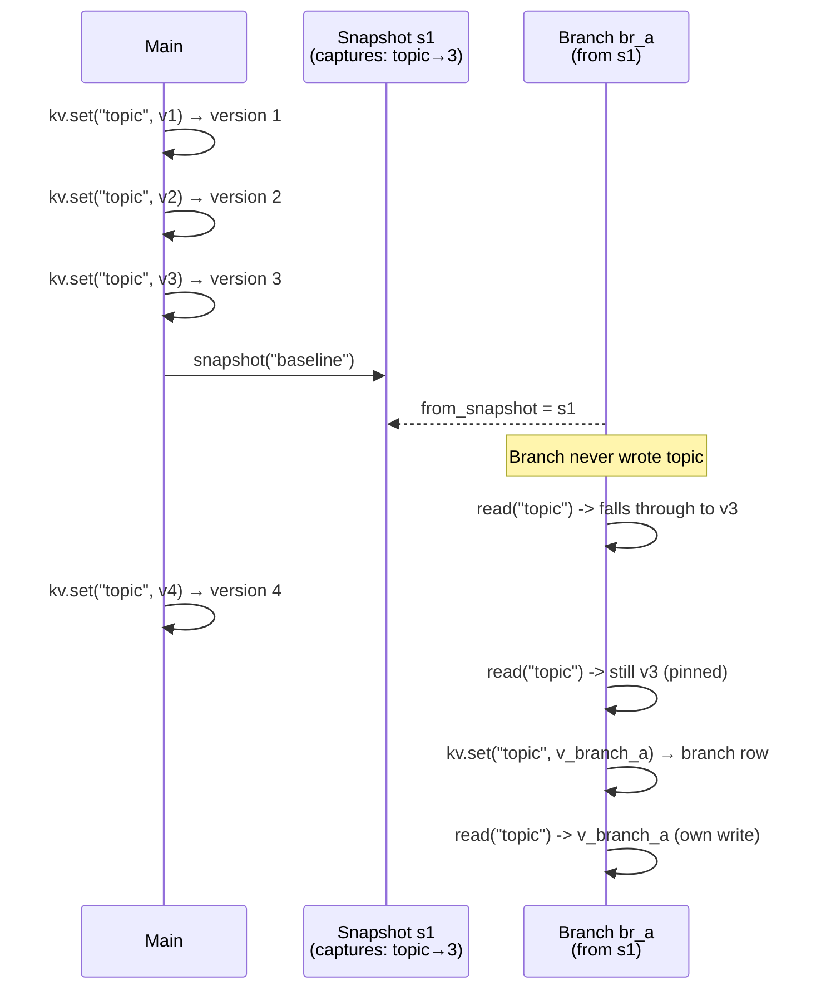
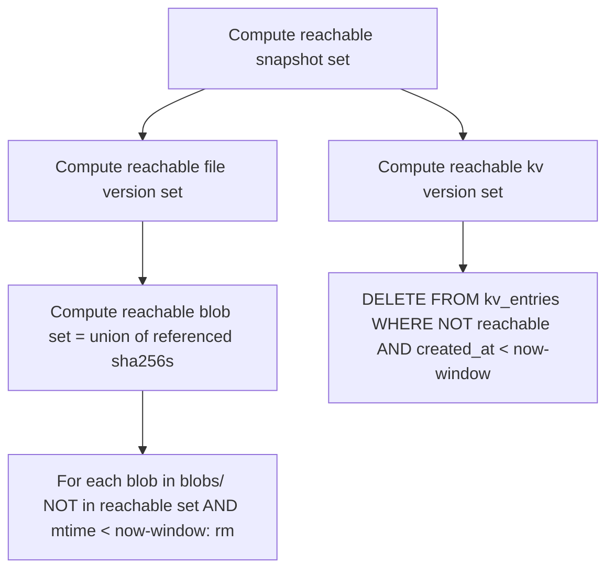
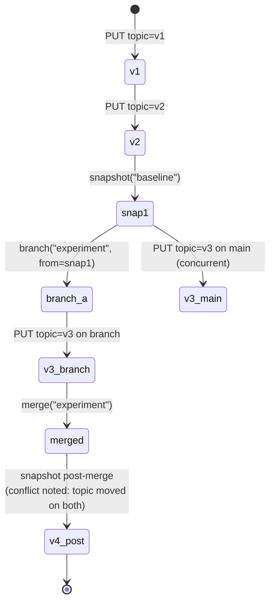

# 02 — Workspace Design

> **Why this exists.** The workspace is half of v0.1 (the other half is the gateway). It is the structured memory the agent uses instead of stuffing state into the chat history. This document covers the versioning model in detail, branch semantics with code-level pseudocode, snapshot capture, merge rules, and garbage collection — the things that determine whether the workspace can be trusted in production.

## 1. Mental model

Think of the workspace as **a version-controlled key-value store with a file blob plane attached**. It's not Git (no DAG, no rebase) and it's not S3 versioning (we have branches). The closest analogue is a relational store with an `effective_version` column on every row, plus a "snapshot" table that pins a coherent point in time across many keys.

The four object types and their relationships:

```
Workspace
  ├── KVEntry (key, version)        — versioned JSON values
  ├── FileEntry (path, version)     — versioned blob refs
  ├── Snapshot (snap_id)            — { kv: {key→ver}, files: {path→ver} }
  └── Branch (branch_id)            — based on a snapshot, has its own writes
```

Pydantic shapes are in `CONTRACTS.md`; the implementation lives at `services/workspace/src/plinth_workspace/storage.py` (PUT/GET) and `services/workspace/src/plinth_workspace/branches.py` (branch reads).

## 2. Versioning model

### The decision: monotonic int per (workspace, key/path)

Every write to a key creates a new immutable row. The version is a per-key counter:

```sql
-- in workspace.db
CREATE TABLE kv_entries (
    workspace_id TEXT  NOT NULL,
    key          TEXT  NOT NULL,
    version      INTEGER NOT NULL,
    value_json   TEXT  NOT NULL,
    deleted      INTEGER NOT NULL DEFAULT 0,
    branch_id    TEXT,
    created_at   TEXT  NOT NULL,
    PRIMARY KEY (workspace_id, key, version, branch_id)
);
CREATE INDEX kv_latest ON kv_entries(workspace_id, key, branch_id, version DESC);
```

The next version for a key is `(SELECT COALESCE(MAX(version), 0) + 1 FROM kv_entries WHERE ...)`. Reads for "latest" are `ORDER BY version DESC LIMIT 1`. There is no global clock, no UUIDs, no Lamport timestamps.

### Why monotonic int, and what we considered

| Option | Why we rejected it |
|---|---|
| Wall-clock timestamp | Two writes within the same millisecond collide; clock skew across nodes would scramble ordering once we go multi-node. |
| UUIDv7 | Better than v4 (sortable) but still 128 bits per row, no human-readable "what version is this?" answer. |
| Lamport / vector clock | Solves causality across nodes, but v0.1 is single-node and v1.0 will route a single workspace to a single primary anyway (see ADR 0006). The complexity buys nothing yet. |
| Content-addressed (hash → blob) | We use this for *file contents*, but not for the version identifier. Hash means "what's in this row"; version means "where in history is this". Conflating them loses ordering information. |
| Monotonic int per key | ✅ Trivial to compute, trivial to read, monotonic by construction within a key. The only correctness invariant is "INSERT must atomically read-and-bump", which a single SQLite transaction gives us for free. |

The trade-off: if we ever shard a single workspace across multiple primaries, we'd have to revisit. We accept that — the design assumption is that one workspace is "small enough for one DB" indefinitely. A workspace is roughly the scope of a single agent task or session, not the whole organization's state.

### Tombstones

`DELETE` does not remove rows. It writes a new version with `deleted = 1` and `value_json = NULL`. This:
- Preserves history (you can still read old versions explicitly)
- Makes the latest-read consistent with the delete (`ORDER BY version DESC` returns the tombstone first)
- Allows an "undelete" via a new write at version+1 with the previous value

Garbage collection eventually compacts tombstones away (see §6).

## 3. Read semantics — the fall-through rule

A read against a branch needs to "see" both the branch's own writes and everything inherited from the snapshot the branch was forked from. The rule is straightforward:

```python
# pseudocode — services/workspace/src/plinth_workspace/branches.py
def read_kv(ws_id: str, key: str, branch_id: str | None) -> KVEntry | None:
    if branch_id is None:
        # main timeline: latest version with branch_id IS NULL
        return latest_main(ws_id, key)

    # 1. Did this branch write to the key?
    own = latest_on_branch(ws_id, key, branch_id)
    if own is not None:
        return own  # branch writes win, including tombstones

    # 2. Otherwise, fall through to the version pinned by the source snapshot
    branch = get_branch(branch_id)
    snap = get_snapshot(branch.from_snapshot_id)
    pinned_version = snap.kv_versions.get(key)
    if pinned_version is None:
        return None  # key didn't exist at fork time and branch never wrote it
    return get_kv_at_version(ws_id, key, pinned_version)
```

The same rule applies to files. The corresponding snapshot read uses `snap.file_versions[path]`.

A critical property: **branch reads pin to the snapshot, not to "main as of now"**. If main writes `topic = "v2"` after the fork, a read on the branch still sees the original `"v1"` from `from_snapshot`. This is what makes branches a sandbox.



## 4. Snapshots — lazy by design

A snapshot is **a metadata record that captures the latest version of every key and every path at the moment of capture**. It is not a copy of the data.

```sql
CREATE TABLE snapshots (
    id                 TEXT PRIMARY KEY,
    workspace_id       TEXT NOT NULL,
    name               TEXT NOT NULL,
    message            TEXT,
    parent_snapshot_id TEXT,
    created_at         TEXT NOT NULL,
    kv_versions_json   TEXT NOT NULL,   -- {"topic": 3, "sources/url1": 7, ...}
    file_versions_json TEXT NOT NULL    -- {"report.md": 2, ...}
);
```

Capturing a snapshot is therefore a **single SELECT-and-store**: read the latest version of every key on the targeted timeline, dump it into a JSON map, write the row. Snapshots are O(unique-keys) in size, not O(history).

This has two big consequences:

1. **Snapshots are cheap.** Even a workspace with thousands of keys snapshots in milliseconds. Agents can take them liberally — before risky operations, between phases, on every iteration.
2. **The underlying versions cannot be GC'd while a snapshot references them.** The snapshot is a *root* for the version-retention algorithm. See §6.

### Why not copy-on-write file content?

For the KV plane, the JSON value is small enough that we just store the row. For the file plane, we content-address: the SHA256 of the bytes is the blob filename, multiple FileEntries can reference the same blob. Snapshotting a 1GB file is therefore a metadata operation; the blob never moves.

```sql
CREATE TABLE file_entries (
    workspace_id TEXT NOT NULL,
    path         TEXT NOT NULL,
    version      INTEGER NOT NULL,
    sha256       TEXT NOT NULL,        -- points into blobs/<sha256>
    size         INTEGER NOT NULL,
    content_type TEXT NOT NULL,
    deleted      INTEGER NOT NULL DEFAULT 0,
    branch_id    TEXT,
    created_at   TEXT NOT NULL,
    PRIMARY KEY (workspace_id, path, version, branch_id)
);
```

The blob is a `blobs/<sha256>` file in `$PLINTH_DATA_DIR`. Writing the same content twice produces the same hash and is a no-op for blob storage. This is the same trick `git`, IPFS, and Restic all use.

## 5. Merge semantics

### v0.1: last-write-wins with conflict surfacing

Merging a branch back to main produces a new snapshot whose `kv_versions` and `file_versions` reflect the merged state. The merge is a left-join with branch-wins-on-conflict semantics:

```python
# pseudocode
def merge_branch(branch_id: str) -> MergeResult:
    branch = get_branch(branch_id)
    base   = get_snapshot(branch.from_snapshot_id)
    head   = current_main_snapshot(branch.workspace_id)

    conflicts = []
    for key in keys_modified_on_branch(branch_id):
        base_v   = base.kv_versions.get(key)        # what the branch saw at fork
        main_v   = head.kv_versions.get(key)        # what main has now
        if base_v != main_v and main_v is not None:
            conflicts.append(key)                   # both sides moved
        promote_branch_write_to_main(key)

    create_merge_snapshot(branch_id, conflicts=conflicts)
    mark_branch_merged(branch_id)
```

In v0.1 we **promote the branch's write unconditionally** but report the conflict in the response. Callers decide what to do (typically: re-read main, re-resolve, write again). This is honest about the trade-off: we don't claim to do automatic three-way merging, but we surface enough information for the agent or human to do it.

### What v0.2 adds

Two strands of work, neither in v0.1:

- **Three-way semantic merge for KV values.** When both sides modified a JSON object, attempt a deep merge (added/removed keys disjoint, modified keys conflict). For lists, more interesting strategies (append-only sets, position-keyed maps).
- **CRDT-shaped types as opt-in.** A key declared `LWW-counter` or `OR-set` can merge automatically. We expect this to matter once multi-agent workflows actively concurrently mutate shared state — a scenario v0.1 doesn't have.

We are not building a Git-style DAG. Branches in Plinth are short-lived (an experiment, a hand-off staging area), not long-running development lines. The complexity of full DAG resolution doesn't pay back.

## 6. Garbage collection

The version model is append-only. Without GC, a workspace grows forever. The retention algorithm:

A version `v` of key `k` is **reachable** if any of:
1. It is the latest version on main, or the latest version on any non-merged branch.
2. It is referenced by `kv_versions[k] = v` in any snapshot that is itself reachable.
3. Its `created_at` is within the **retention window** (default: 7 days).

A snapshot is reachable if any of:
- It is the `from_snapshot` of any non-merged branch.
- It is named (i.e. agent-created with a name, not a system-internal anonymous one).
- It is within the retention window.

A blob is reachable if any FileEntry referencing its `sha256` is reachable.

The GC sweep:



In v0.1, GC is **not implemented** — workspaces are scoped to a single PoC run and the data dir is `/tmp/plinth-data`. v0.2 will add it as a background task on the workspace process; the algorithm above is the spec.

The retention window protects against a race where a long-running operation has read a version and is about to write a derived version, but a sweep runs in between. With a window large enough to swamp any reasonable workflow latency (7 days is overkill), this is a non-issue.

## 7. Lifecycle — a worked example



Reads at each phase:
- After `v1`: `read(topic)` → `"v1"` (main, version 1)
- After `v2`: `read(topic)` → `"v2"` (main, version 2)
- After `snap1`: `snap1.kv_versions["topic"] = 2`. Snapshots are immutable.
- After branching: `read(topic, branch=experiment)` → falls through to v2 (pinned by snap1)
- After `v3_branch` and `v3_main`: branch reads see branch's v3, main reads see main's v3
- Merge: branch's value wins, conflict reported, new snapshot pins the post-merge state

## 8. Open questions / future directions

- **Snapshot diffs at scale.** Computing the diff between two snapshots is O(union of keys). For a big workspace (1M keys) this gets expensive. A Bloom-filter side-index per snapshot is the planned answer.
- **Cross-workspace snapshot import.** "Fork your snapshot into my workspace" is a desirable hand-off primitive. Today, workspaces are isolated. Cross-import has to think about ID collisions and provenance.
- **Compression / deduplication of historical KV values.** Right now `value_json` is stored as full text per row. For verbose values that change slightly, a delta scheme would help. Not a v0.1 concern; possibly relevant if customers ship large JSON blobs through KV (they should use files instead, but they often won't).
- **Fast-forward branches.** A common pattern: branch from snap, do some writes, then merge before main moves. We can detect "main hasn't moved since fork" and skip conflict bookkeeping. Easy optimisation but worth measuring before adding code.
- **Reflog / undo.** Even with GC, a "show me everything I deleted in the last hour" view is useful. The append-only design supports this; we just need to expose it.

For the API surface, see `CONTRACTS.md` §Workspace API. For the storage decisions behind this design, see ADR 0002 (storage) and ADR 0006 (multi-tenancy).
