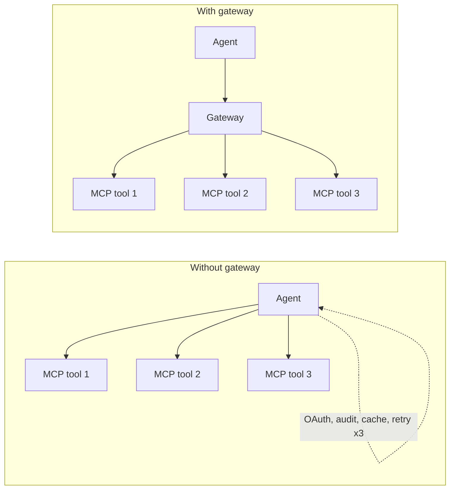
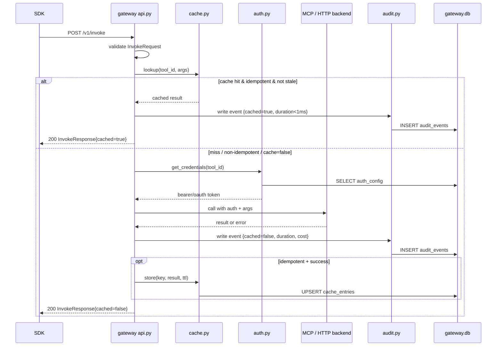
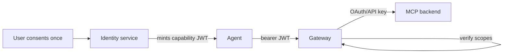

# 03 — Tool Gateway Design

> **Why this exists.** The gateway is where every external action passes through. It is the difference between an agent that mass-fetches the same URL 8 times and one that pays once. It is also the chokepoint where audit, idempotency, dry-run, and (post-v0.1) capability checks happen. This document is opinionated about why each of those lives at this layer rather than in the SDK or a sidecar.

## 1. Why a gateway, not direct MCP calls

If an agent calls 10 MCP servers directly, the caller is now responsible for:

- 10 OAuth flows and 10 sets of refresh tokens
- 10 different error/response conventions
- 10 unbounded calls to the same endpoint with the same arguments — paying for each
- A bespoke audit hook in every code path
- Per-tool retry, timeout, rate-limit logic

The gateway centralises this. It is **the only thing in the system that talks to external tools**. Centralisation is the entire pitch — it's also the largest single risk (single point of failure, single attack surface). Sections 6 and 7 cover what we do about that.



## 2. Lifecycle of an `/v1/invoke` call



The path is intentionally linear: no fan-out, no async detachment, no fire-and-forget. Every stage is synchronous and observable. The cost of that is per-call latency overhead (~2-5ms on the PoC); the benefit is a single durable record per call with no "did the audit make it?" ambiguity.

## 3. Caching

### Cache key

```
key = sha256( tool_id || canonical_json(args) )
```

`canonical_json` sorts object keys lexicographically, normalises numbers (no trailing zeros, no `.0` for ints), strips whitespace. Without this, `{"a":1, "b":2}` and `{"b":2,"a":1}` would miss each other and inflate the miss rate.

The cache stores: `(key, result_json, created_at, expires_at, tool_id)`. It is a SQL table in `gateway.db` for v0.1 (a real shared cache like Redis is v1.0 cluster work).

### Per-tool TTL — why not global

Different tools have wildly different staleness profiles:

| Tool kind | Sensible TTL | Reason |
|---|---|---|
| `web.fetch` of a static doc | hours | Content rarely changes within a session |
| `web.fetch` of a news feed | seconds, or `idempotent=false` | Freshness matters |
| `fs.read` from a fixture | very long | Fixtures don't change |
| `fs.read` of a working file | 0 / not cached | Content of `report.md` is being mutated |
| Search APIs | 5 minutes | Some staleness ok |
| Mutating tools (`fs.write`, `notes.add`) | never | Caching a write is meaningless and dangerous |

So `cache_ttl_seconds` and `idempotent` are declared **per-tool at registration**, not globally. This pushes the staleness decision to the tool author, who is the only one who knows the answer. See `CONTRACTS.md` §`ToolRegistration`.

### When the cache is bypassed

Three independent bypass conditions, OR'd:

1. The tool is registered with `idempotent=false`.
2. The caller passes `cache: false` in `InvokeRequest`.
3. The tool returned an error on the cached miss path. Errors are **not cached** — a transient failure must not poison subsequent calls.

A subtle one: cache hits do not refresh the entry's TTL. A 5-minute-TTL entry hit at 4 minutes still expires at 5. Otherwise hot keys never expire and become a source of stale data forever.

### What about non-determinism?

Some "logically idempotent" tools return slightly different output on each call: timestamps inside the result, ordered-but-not-stable lists, internal request IDs. Three options:

- **Tool authors normalise their own output** (preferred). The contract for `idempotent=true` is "same args → same result". If your output isn't, set `idempotent=false`.
- **The gateway strips known-noise fields** before hashing the result. Not implemented in v0.1 — too tool-specific to do generically.
- **Result hashing is informational, not semantic.** We never use the result hash for cache lookup; only the *args* hash is the cache key. The result hash is for audit dedup ("two calls returned the same thing").

We pick option 1: explicit, simple, places responsibility correctly. If it turns out a class of tools all need stripping, we'll add a registry-level transform; not before.

## 4. Audit log

### What we record

Every invocation produces an `AuditEvent` (see `CONTRACTS.md` §`AuditEvent`):

- `id`, `timestamp`, `tool_id`
- `workspace_id`, `agent_id` — both nullable, both attribution metadata
- `arguments_hash`, `result_hash` — SHA256, never the raw values, to avoid persisting potentially-sensitive data here
- `cached: bool`, `duration_ms`, `cost_estimate_usd`
- `error: str | None`

Notably absent: the raw arguments and the raw result. We index by hash so that "this exact call happened before" is queryable, but we don't make audit a parallel data store. If the user wants the actual content, the workspace is the right place — the agent stored what it cared about there.

### Append-only by construction

The audit table has no `UPDATE` or `DELETE` paths in the API. The schema:

```sql
CREATE TABLE audit_events (
    id                TEXT PRIMARY KEY,
    timestamp         TEXT NOT NULL,
    tool_id           TEXT NOT NULL,
    workspace_id      TEXT,
    agent_id          TEXT,
    arguments_hash    TEXT NOT NULL,
    result_hash       TEXT,
    cached            INTEGER NOT NULL,
    duration_ms       INTEGER NOT NULL,
    cost_estimate_usd REAL NOT NULL DEFAULT 0,
    error             TEXT
);
CREATE INDEX audit_by_workspace ON audit_events(workspace_id, timestamp DESC);
CREATE INDEX audit_by_tool      ON audit_events(tool_id, timestamp DESC);
```

There is no DBA path for cleanup short of explicit retention sweeps (which produce a record themselves: `audit_retention_run` events).

### Future: cryptographic chaining

Post-v0.1 we will add `prev_hash` and `event_hash` columns. Each event's hash is `H(prev_hash || canonical_json(event_minus_hash))`. This produces a tamper-evident chain: you can detect any retroactive edit or deletion by replaying hashes. Inspired by transparency-log designs (Trillian, Sigstore Rekor).

We are not doing this in v0.1 because the threat model is "a single dev machine running locally". The chain matters once we have multiple operators, customer trust requirements, and a real attack surface.

### Retention

v0.1: unbounded (it's a PoC, the DB is `/tmp/plinth-data/gateway.db`). v0.2: configurable retention window per tool category, default 90 days for `read` tools, 1 year for `write` tools. Aggregated stats (`audit_stats`) survive forever.

## 5. Auth

### v0.1: the mock

`Authorization: Bearer <token>` where any non-empty value is accepted. The gateway records the value as `agent_id` if the SDK populated `agent_id` in the request body, but doesn't verify anything. This is safe only because the PoC is single-tenant on a developer's box.

The gateway also holds **per-tool credentials**. When a tool is registered with `auth_method: "bearer"` and `auth_config: {"token": "..."}`, the gateway uses that token when proxying. So the agent-to-gateway auth and the gateway-to-backend auth are decoupled — which is the entire reason for centralisation.

### Production design (post-v0.1, see ADR 0006 and arch doc 06)

Two auth tiers:

1. **Agent → Gateway.** Capability tokens — short-lived JWTs encoding `{agent_id, workspace_id, tool_scopes, expires_at}`. Issued by the Identity service, verified at the gateway, never delegated to backends.
2. **Gateway → Backend tool.** OAuth refresh tokens, API keys, mTLS certs — whatever the backend wants. The gateway is the *resource server* for tools, holding long-lived credentials that the agent never touches.



The agent never sees the OAuth token. The user never re-authenticates per call. The agent's blast radius is bounded by the JWT scopes. This is spelled out in arch doc 06.

## 6. Idempotency keys

`InvokeRequest.idempotency_key` is an opaque client-generated string. When set, the gateway treats `(tool_id, idempotency_key)` as a deduplication key with a fixed TTL window (24h default).

Semantics:
- First call with `(tool_id, idempotency_key)` executes normally.
- Subsequent calls within the window return the **same response** as the first, including `audit_id`. They are a cache hit at the idempotency-key layer, regardless of whether the args are byte-for-byte identical.
- After the window, the key is forgotten and behaves as a new request.

Why this is separate from the args-hash cache:

- The args-hash cache exists for performance (don't fetch the same URL twice). It's keyed on **what you're asking**.
- The idempotency cache exists for retry safety. It's keyed on **the caller's intent to do this exactly once**. The caller picks the key, often `f"{workflow_id}:{step_id}"`.

Mutating tools (e.g. `notes.add`) are the canonical case: you can't argue "same args → same result" for an append, but you can argue "same idempotency key → don't apply twice".

## 7. Dry-run

`POST /v1/invoke/dry-run` returns a `DryRunResponse` with:

- `would_invoke: bool` — true if a real call would happen (i.e. cache miss, idempotent path, etc.)
- `cached_result: Any | None` — the cached value if there is one
- `estimated_cost_usd`, `estimated_duration_ms` — best-effort estimates from prior history of this tool

Dry-run **never calls the backend, never writes to the cache, never appends a regular audit event**. It does emit a `dry_run` synthetic event for traceability but flags it clearly.

Use cases:
- An agent's planner wants to know "if I call `web.fetch` on these 50 URLs, what's the cost?"
- A test harness wants to verify a workflow's plan without spending real money.
- An approval UI wants to show the user "the agent is about to do X, which costs ~$0.40" before authorizing.

The cost estimate is naive: median observed cost of this tool, scaled by argument-size heuristic. Honest about the limits. We are not going to estimate the cost of arbitrary HTTP calls accurately; we are good enough for a "is this $0.01 or $10" decision.

## 8. Failure modes (gateway-specific)

| Failure | Behavior |
|---|---|
| Backend returns 5xx | Cache untouched, audit event records `error`, gateway returns 502 to caller |
| Backend times out (default 30s) | Same as above with `error: "timeout"`. No background retry. |
| Audit insert fails (disk full) | Invocation is **rejected** — we fail closed rather than execute un-audited |
| Cache write fails | Invocation succeeds, warning logged, next call will be a miss |
| Capability check fails (post-v0.1) | 401 with `code: "INSUFFICIENT_SCOPES"`, no backend call |
| Two simultaneous requests with same idempotency key | Second waits on first via SELECT-then-INSERT-or-update; serialized within a SQLite transaction |

The "fail closed on audit failure" is the most aggressive of these. We considered "fail open with a conspicuous warning" and rejected it: an unrecorded tool call is exactly the kind of operational hazard that makes auditors nervous, and making this configurable buys nothing — the right answer is to fix the audit substrate, not work around it.

## 9. Open questions / future directions

- **Backpressure on slow backends.** Today we serialize per-request; a slow MCP server holds a uvicorn worker. Concurrency limits per-backend (semaphore-based) is the obvious next step.
- **Streaming backends.** Some MCP servers stream large responses. The gateway currently buffers fully before responding. A streaming pass-through is feasible but complicates audit (when is the call "done" for the purposes of cost recording?).
- **Cache compression.** Result JSON for `web.fetch` of large pages bloats the cache table. zstd at the boundary is a one-line addition once we measure that it matters.
- **Per-tenant cache partitioning.** The cache is logically global today. With multi-tenant (ADR 0006), do we share cache across tenants for the same `(tool_id, args)`? Sharing is more efficient but reveals "another tenant fetched this URL" via timing. Default to per-tenant; offer opt-in sharing for non-sensitive tools.
- **Cryptographic audit chaining.** Spec'd above; implementation is post-v0.1.
- **MCP-spec extension.** `cache_ttl`, `idempotent`, `side_effects` are Plinth-specific tool metadata today. ADR 0003 covers our intent to upstream these to MCP.

For the API surface, see `CONTRACTS.md` §Gateway API. For why MCP at all, see ADR 0003. For the auth tiers, see arch doc 06 and ADR 0006.
