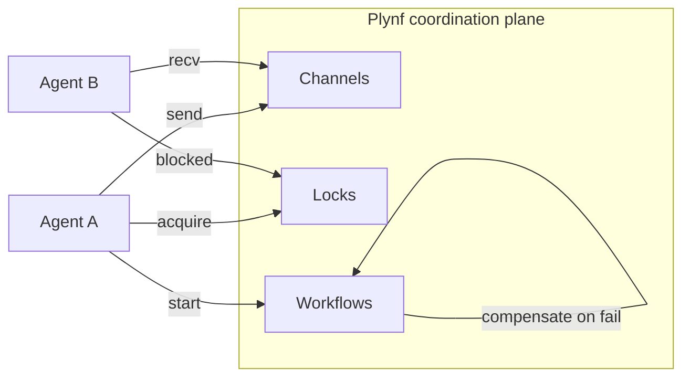
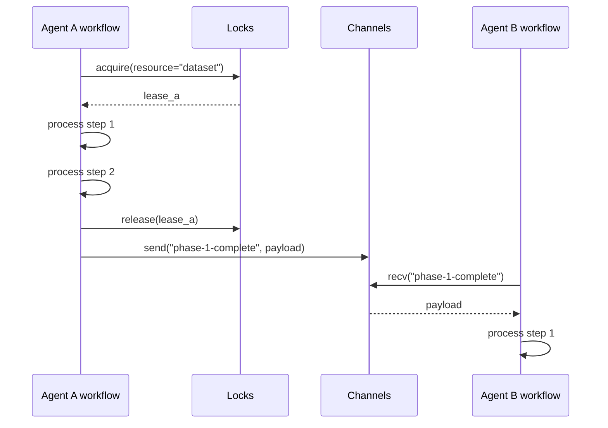

# 04 — Coordination Primitives (v0.2 sketch)

> **Why this exists.** v0.1 ships a single-agent substrate. The moment you have two agents on the same workspace — a researcher and a writer, a planner and a worker — you need primitives to keep them out of each other's way and let them hand off cleanly. This document is the design spec for those primitives. Nothing here is implemented; this is what we plan to build, and (more importantly) what shape we are committing to in the v0.1 API and storage decisions so that v0.2 doesn't require a rewrite.

## 1. The problem space

A naive multi-agent setup uses chat messages to coordinate: agent A says "I'm done", agent B reads the chat and starts. This breaks for the same reason single-agent chat-as-state breaks: the channel is unstructured, there's no durability, no replay, and "did B actually pick up the message?" is a guess.

The three primitives Plynf proposes to formalise this:

1. **Channels** — typed, durable, ordered message passing between named agents.
2. **Locks / leases** — one agent holds a named resource for a bounded time.
3. **Workflow transactions** — group a sequence of tool calls into a unit that either fully succeeds or compensates back, durably.

These are not novel in distributed systems. They are novel in *agent-substrate* form: each is exposed at the right level of abstraction for an LLM-driven caller, with audit and replay built in.



## 2. Channels

### Concept

A channel is a named queue with **typed messages** and **durable delivery**. An agent writes; one or more agents read. Messages persist until consumed (or until retention expires). Order is per-channel FIFO.

### Proposed API surface

```
POST   /v1/channels                                 → 201 {Channel}
GET    /v1/channels                                 → 200 {channels: [Channel]}

POST   /v1/channels/{ch_id}/send                    → 200 {Message}
       body: {payload: <conforming to schema>, sender_agent_id, headers?}

POST   /v1/channels/{ch_id}/recv                    → 200 {Message | null}
       body: {receiver_agent_id, wait_seconds?: 0..30}
POST   /v1/channels/{ch_id}/ack                     → 204
       body: {receiver_agent_id, message_id}

GET    /v1/channels/{ch_id}/replay?since=...        → 200 {messages: [...]}
```

### Schema

```python
class Channel(BaseModel):
    id: str                  # ch_<ulid>
    name: str
    workspace_id: str | None # optional scoping
    schema: dict             # JSON Schema for payloads
    delivery: Literal["at-least-once", "exactly-once"]
    retention_seconds: int   # default 7 days
    created_at: datetime

class Message(BaseModel):
    id: str                  # msg_<ulid>
    channel_id: str
    sender_agent_id: str
    payload: Any             # validates against Channel.schema
    headers: dict[str, str]
    sent_at: datetime
    delivered_to: list[tuple[str, datetime]]   # agent_id → first delivery
    acked_by: list[tuple[str, datetime]]
```

The schema is **declared on the channel**, not derived. We validate `payload` against it on every send. Messages that don't conform are rejected, not delivered. This forces the contract to be explicit — which is the whole point of typed channels vs. chat.

### Delivery semantics

- **at-least-once** (default): `recv` returns the next undelivered message. The receiver must `ack` within a visibility timeout (30s default) or the message becomes redeliverable. Duplicate handling is the receiver's job.
- **exactly-once**: same as above plus an `idempotency_key` derived from the `message_id` and `receiver_agent_id`. Together with workflow transactions (§4), this gives durable exactly-once consumption.

We do not promise broker-strength delivery. The implementation is an SQLite/Postgres table with `INSERT` semantics; this is good enough up to thousands of messages per second per channel. For higher throughput, a real broker (NATS, Kafka) belongs underneath.

### Replay

Every channel keeps messages for `retention_seconds`. `GET /channels/{id}/replay?since=...` returns the full history. This makes "what did agent A say to agent B during this run?" a simple query, and underwrites the observability layer (arch doc 05).

### Failure scenarios

| Scenario | Behavior |
|---|---|
| Receiver crashes after recv before ack | Message redelivered after visibility timeout |
| Sender crashes mid-send | Either the message landed (consumers see it) or didn't (consumers don't); no partial state |
| Schema mismatch on send | 400, message not stored, audit event records the rejection |
| Channel retention expired before recv | Receiver sees an empty queue; the lost message is in `replay` until retention |

## 3. Locks and leases

### Concept

A **lease** on a named resource means: "for the next T seconds, only this agent may treat this resource as exclusively held". The mechanism is advisory — Plynf does not enforce that the resource isn't touched by other paths. But it gives agents a coordination point.

### Proposed API

```
POST   /v1/locks/acquire
       body: {resource: str, agent_id, ttl_seconds, wait_seconds?}
       → 200 {Lease} or 409 {currently held by other_agent_id, expires_at}

POST   /v1/locks/{lease_id}/renew
       body: {ttl_seconds}            → 200 {Lease}

POST   /v1/locks/{lease_id}/release   → 204

GET    /v1/locks                      → 200 {leases: [...]}
```

```python
class Lease(BaseModel):
    id: str                  # lease_<ulid>
    resource: str
    holder_agent_id: str
    acquired_at: datetime
    expires_at: datetime
    renewals: int
```

### Why leases, not raw locks

A raw lock that doesn't expire is a deadlock waiting to happen — an agent crashes mid-hold and now nothing else can run. A lease has a TTL by construction. The holder can renew (must, if it's still working) or let it expire. Either way, the system makes progress without operator intervention.

The default TTL is generous (5 minutes). Renewal at 50% of TTL is the recommended pattern. The SDK will provide a context manager that auto-renews:

```python
async with client.lock("dataset:reuters-2026", ttl=300) as lease:
    # work happens here, SDK renews at 150s, 300s, ...
    process_dataset()
```

### Granularity guidance

Resource names are namespaced strings. Conventions:

- `workspace:{ws_id}:exclusive` — full-workspace lock for migrations etc.
- `workspace:{ws_id}:branch:{branch_id}:write` — single-writer per branch
- `tool:{tool_id}:rate-window:{minute}` — application-level rate-limiting via leases (cute hack, occasionally useful)
- `external:{your-resource-name}` — agent-defined

Plynf does not validate names against a schema; conventions are documentation, not enforcement.

### Failure scenarios

| Scenario | Behavior |
|---|---|
| Holder crashes | Lease expires after TTL, next `acquire` succeeds |
| Holder partition (network split) | Holder might still believe it owns the lease while the lease expires server-side. Holder must re-check on critical operations. We don't solve the two-generals problem; we make it observable. |
| Two simultaneous `acquire` calls | One wins (UPSERT-with-condition), other gets 409 |
| Lease renewal after expiry | 409, holder must restart from `acquire` |

## 4. Workflow transactions

### Concept

A workflow is **a named sequence of tool calls and workspace writes that should either fully succeed or roll back via compensating actions**. Plynf runs the workflow durably: progress is persisted at every step, the workflow can resume after a crash, and on failure the compensations run in reverse.

### Proposed API

```
POST   /v1/workflows                       body: {WorkflowDef}    → 201 {Workflow}
POST   /v1/workflows/{wf_id}/start         body: {input: {...}}   → 200 {WorkflowRun}
GET    /v1/workflows/{wf_id}/runs/{run_id}                        → 200 {WorkflowRun}
POST   /v1/workflows/{wf_id}/runs/{run_id}/cancel                 → 200 {WorkflowRun}
```

```python
class Step(BaseModel):
    id: str
    kind: Literal["invoke", "kv_set", "kv_delete", "file_write", "snapshot", "branch", "merge"]
    args: dict
    compensate: dict | None    # parallel definition of how to undo

class WorkflowDef(BaseModel):
    id: str
    name: str
    steps: list[Step]
    on_failure: Literal["compensate", "halt", "continue"]

class WorkflowRun(BaseModel):
    id: str
    workflow_id: str
    state: Literal["running", "succeeded", "failed", "compensating", "rolled-back", "cancelled"]
    cursor: int               # next step index to execute
    completed_steps: list[StepResult]
    started_at: datetime
    ended_at: datetime | None
```

### Example: a research workflow

```yaml
name: research-and-report
steps:
  - id: search
    kind: invoke
    args: {tool_id: "web.search", arguments: {query: "${input.topic}"}}

  - id: fetch-each
    kind: invoke           # for-each handled via fan-out, sketch only
    args: {tool_id: "web.fetch", arguments: {url: "${search.results[*].url}"}}

  - id: store-sources
    kind: kv_set
    args: {key: "sources", value: "${fetch-each.results}"}
    compensate: {kind: "kv_delete", args: {key: "sources"}}

  - id: write-report
    kind: file_write
    args: {path: "report.md", content: "${input.template}"}
    compensate: {kind: "file_delete", args: {path: "report.md"}}

  - id: snapshot
    kind: snapshot
    args: {name: "research-complete"}
on_failure: compensate
```

If `write-report` fails, the engine runs `kv_delete sources` (the compensation for `store-sources`) and stops. The workspace ends up exactly as it was before the workflow started — modulo any tool-side effects that the gateway's idempotency framework should catch.

### How this maps to Temporal/Restate underneath

ADR 0004 covers the choice. Short version: we plan to use **Temporal** as the durable execution engine for v0.3. The Plynf workflow API becomes a thin shim that translates `WorkflowDef` into Temporal workflows and Plynf steps into Temporal activities. We get retries, durable timers, signals, and replay-from-history for free.

The reason we **don't** just expose Temporal directly:

- Agents don't speak Java/Go. The Temporal client SDKs are not LLM-friendly.
- The Plynf workflow is a *typed list of steps*, suitable to plan/inspect/validate before execution. Temporal workflows are arbitrary code.
- The compensation model is first-class in our API; in Temporal it's a code pattern (saga).

So Temporal becomes the executor. Plynf provides the schema, the API, the audit binding, and the workspace integration.

### Failure scenarios

| Scenario | Behavior |
|---|---|
| Step fails, on_failure=compensate | Engine runs compensations of all completed steps, in reverse |
| Step fails, on_failure=halt | Workflow paused at cursor, agent can inspect and resume |
| Engine process crashes mid-step | On restart, durable state has the cursor; resume from the next pending step (Temporal handles this) |
| Compensation fails | Workflow goes to `rolled-back-with-failures` state, audit event for each compensation result, requires human intervention |

## 5. How these compose

The three primitives are independent but designed to compose:

- A workflow step can `acquire` a lease before doing its work, `release` after.
- A workflow can `send` on a channel as one of its steps, signaling another agent.
- A multi-agent dance: agent A's workflow finishes step 3, sends `done-with-phase-1` on a channel; agent B's workflow has step 1 = `recv` on that channel and proceeds.



## 6. What this implies for v0.1

We commit to nothing v0.1 has to ship, but we *do* need v0.1 to leave room:

- **Workspace versioning is the substrate** that workflow rollback uses. Compensations write a new version; the snapshot taken before the workflow lets us hard-rollback if compensation itself fails. Branches are the natural sandbox for "try a workflow, decide if we keep it".
- **Audit IDs are stable references**. Channel messages and workflow steps cite the relevant `audit_id` so traces are coherent across primitives.
- **Idempotency keys at the gateway** (arch doc 03) are how a workflow re-executes a step safely after a resume.

In other words, v0.1's gateway and workspace are designed so that v0.2 coordination snaps in without surgery.

## 7. Open questions / future directions

- **Workflow definition source.** YAML? Python decorators? A typed builder API? Likely all three, with a JSON Schema underneath. The early demo will probably use a Python builder; YAML is for static catalogs.
- **Streaming workflow events.** SSE on `/workflows/{id}/runs/{run}/events` would let dashboards show live progress. Cheap, but waits on the observability work in arch doc 05.
- **Cross-workflow transactions.** "If workflow A succeeds, then start workflow B". This is just a step that `start`s B — but the failure semantics get interesting (is failure of B a failure of A?).
- **Sub-second lock granularity.** SQLite/Postgres-backed leases are fine at the second granularity. If we need millisecond-grain (we shouldn't, in agent workloads), Redis is the obvious switch.
- **Channel fan-out.** Today we sketch single-receiver semantics. Pub/sub fan-out is a v0.3 question — most agent coordination is point-to-point.
- **Operator override.** A human dashboard that can `cancel`, `force-release`, or `compensate-now` a stuck workflow. The substrate supports it; UX is a v0.4 deliverable.

For the upstream choice (Temporal vs. Restate vs. custom), see ADR 0004. For how this connects to the event log, see arch doc 05. For why the workspace versioning model anticipates these primitives, see arch doc 02 §6 and ADR 0002.
