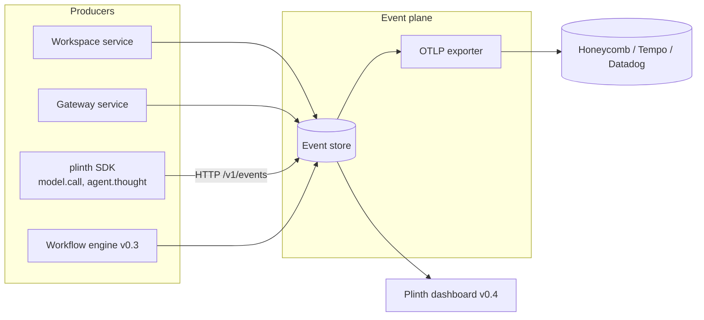
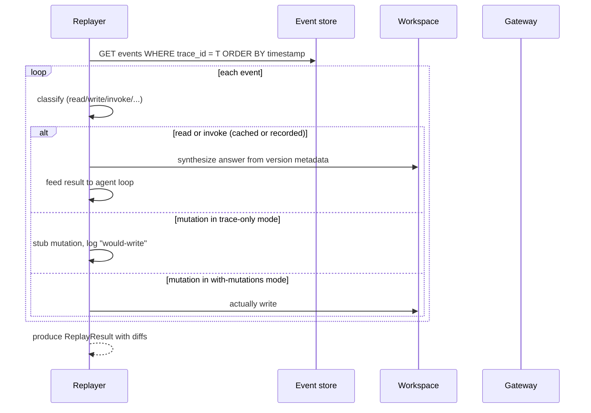

# 05 — Observability Plane (v0.2 sketch)

> **Why this exists.** v0.1's gateway audit log is a flat list of "tool X was called with args-hash Y at time Z". That is enough to debug a single workflow but nothing close to enough to operate a fleet of agents at production scale. This document specifies the v0.2 observability plane: a unified semantic event stream, deterministic replay, OTLP export, and per-agent / per-workspace cost rollups.

## 1. Why we need a separate observability layer

The gateway audit captures tool calls. The workspace doesn't capture *why* a write happened; only that it did. To answer questions like:

- "What did this agent reason about between step 3 and step 4?"
- "Show me every action this agent took in this workflow run, in order, including model calls"
- "Which workspace burned the most tokens this week?"
- "Replay this run from event 312 and stop at event 318"

…we need to capture more than tool invocations. We need to capture **what the agent did, what it cost, what state moved, and what the agent thought about while doing it** — in a single time-ordered stream.

We propose this stream is an additive observability layer that subsumes the gateway audit log (it remains queryable; new events flow through both for v0.2's transition).

## 2. The semantic event schema

Every action emits one event. The schema is JSON, OTLP-compatible, and lives at `specs/schemas/event.schema.json` once that file exists in v0.2 work. The shape:

```jsonc
{
  "id": "evt_01HZ...",
  "timestamp": "2026-05-05T14:23:11.382Z",
  "kind": "tool.invoke" | "kv.write" | "kv.read" | "file.write" | "file.read"
        | "snapshot.create" | "branch.create" | "branch.merge"
        | "workflow.start" | "workflow.step.start" | "workflow.step.end"
        | "channel.send" | "channel.recv"
        | "lock.acquire" | "lock.release"
        | "model.call"             // <-- NEW: model API calls, when SDK reports them
        | "agent.thought",         // <-- NEW: optional reasoning trace
  "trace_id": "trc_...",           // groups events from the same workflow run
  "span_id": "spn_...",
  "parent_span_id": "spn_..." | null,
  "actor": {
    "agent_id": "agt_...",
    "workspace_id": "ws_..." | null,
    "branch_id": "br_..."  | null
  },
  "subject": {                     // the thing acted on, kind-specific
    "tool_id": "web.fetch"         // for tool.invoke
    // or {"key": "topic", "version": 7} for kv.write
    // or {"path": "report.md", "version": 2} for file.write
    // ...
  },
  "data": {
    "args_hash": "...",            // we never store raw args by default
    "result_hash": "...",
    "duration_ms": 1230,
    "cached": false,
    "error": null
  },
  "cost": {
    "estimate_usd": 0.0014,
    "tokens_in": 4012,             // for model.call
    "tokens_out": 312
  },
  "extras": { /* free-form */ }
}
```

A few decisions worth calling out:

- **One schema, many `kind`s.** Rather than separate streams per primitive, we union them. Querying "everything this trace_id did" is one filter, not a join.
- **Hashes by default, not raw.** Same as the gateway audit (arch doc 03 §4): we don't make the event log a parallel data store, and we don't want to accidentally persist secrets.
- **`trace_id` and `span_id` are OTLP-aligned.** This makes "send to Honeycomb / Tempo / Jaeger" a re-encoding, not a re-architecting. See §4.
- **`agent.thought` is optional.** If the SDK / agent loop chooses to report a reasoning chunk (chain-of-thought summary, planner output), it shows up as a typed event. Off by default; opt-in via SDK config because of cost and privacy.



## 3. Event store

For v0.2 the event store is **a table in the gateway DB** (or a dedicated `events.db`). Schema:

```sql
CREATE TABLE events (
    id              TEXT PRIMARY KEY,
    timestamp       TEXT NOT NULL,
    kind            TEXT NOT NULL,
    trace_id        TEXT,
    span_id         TEXT,
    parent_span_id  TEXT,
    agent_id        TEXT,
    workspace_id    TEXT,
    branch_id       TEXT,
    subject_json    TEXT,
    data_json       TEXT,
    cost_estimate   REAL,
    tokens_in       INTEGER,
    tokens_out      INTEGER,
    extras_json     TEXT
);
CREATE INDEX events_by_trace     ON events(trace_id, timestamp);
CREATE INDEX events_by_agent     ON events(agent_id, timestamp DESC);
CREATE INDEX events_by_workspace ON events(workspace_id, timestamp DESC);
CREATE INDEX events_by_kind      ON events(kind, timestamp DESC);
```

For v1.0, the event store moves to:
- **OLAP**: ClickHouse or Timescale for the historical table (cost queries, "p99 latency for tool X over 30 days")
- **Stream**: NATS JetStream or Kafka for the live tail (dashboards, alerting)
- **Cold**: S3 / object store with parquet partitioning by day

The v0.2 SQLite pass is intentionally a starter — it stops being plausible somewhere around 10M events. We'd rather not premature-optimize the storage tier and discover it didn't match the query patterns.

## 4. OTLP export

We commit to OTLP-compatible export from day one. The mapping:

| Plinth event | OTLP equivalent |
|---|---|
| `tool.invoke` | Span, with `db.system="plinth-gateway"`, `db.operation="invoke"`, attribs for `tool_id`, `cached`, `cost.estimate_usd` |
| `kv.write` / `file.write` | Span, kind=client, with `plinth.workspace_id`, `plinth.key`, `plinth.version` |
| `model.call` | Span with the standard `gen_ai.*` attributes (per OTel GenAI semantic conventions) |
| `agent.thought` | OTLP log record (not a span — thoughts have no duration) |
| `workflow.step.start` / `.end` | Paired spans, parent = workflow run span |

The exporter runs as a goroutine-equivalent inside the gateway / workspace processes, pushing to a configured OTLP endpoint. Standard env vars:
- `OTEL_EXPORTER_OTLP_ENDPOINT`
- `OTEL_EXPORTER_OTLP_HEADERS`
- `PLINTH_OTLP_SAMPLING` — `1.0` default in dev, `0.1` recommended in prod (sample non-error spans)

Errors and any event with `cost.estimate_usd > 0.01` are always emitted regardless of sampling rate.

## 5. Replay

Replay is the killer use case — and the place where most prior systems stop short. The promise: **given a `trace_id`, reconstruct what the agent saw at any point in its execution**.

### What is deterministic

Replayable cleanly:

- All workspace reads. Versioned KV/files mean "what did the agent see when it read `topic` at time T?" is "the version pinned by the snapshot capturing T's state". The workspace's own time-travel is the foundation.
- All gateway tool invocations *that hit the cache*. The args hash → result is in the cache table; replay produces the same result.
- All workflow steps with `idempotent=true` tools. We can re-run them and get the same outcome.
- All deterministic agent code paths (the parts that don't call the model).

Not cleanly replayable:

- **Tool calls with side effects** (`fs.write`, `notes.add`, anything that mutates external state). Replaying re-mutates. We mark these in events and refuse to re-execute on replay; instead we surface the prior result and a "would re-mutate" flag.
- **Model calls** are non-deterministic. Replay can show the *recorded* response (we capture the full prompt and response in `model.call` events optionally), but cannot re-derive it. With a recorded response, deterministic replay of the agent loop is achievable.

### Replay API (proposed)

```
POST /v1/replays
     body: {trace_id, mode: "trace-only" | "with-mutations"}
     → 200 {replay_id, status: "running"}

GET  /v1/replays/{replay_id}                  → 200 {ReplayResult}
```

`trace-only` reproduces the read paths; nothing is mutated. `with-mutations` replays everything, useful for "recover a workspace state by re-running the workflow".



## 6. Cost attribution

Every event with cost lives in one stream; aggregation is a SQL `GROUP BY`. Default rollups exposed via API:

```
GET /v1/cost/agents?since=...    → [{agent_id, total_usd, tool_calls, model_calls}]
GET /v1/cost/workspaces?since=...→ [{workspace_id, total_usd, ...}]
GET /v1/cost/tools?since=...     → [{tool_id, calls, cached_pct, total_usd, p50_ms, p95_ms}]
GET /v1/cost/workflows?since=... → [{workflow_id, runs, success_pct, avg_usd_per_run}]
```

Multi-tenant deployments will scope these by tenant transparently (see ADR 0006). Customer-facing billing at v1.0 is built directly on top of this — no separate metering pipeline.

We are explicit that costs are **estimates**, not invoiceable amounts. The tool's reported cost (or our heuristic if missing) is recorded; an actual bill is whatever the provider charges. Agreement to within 5% is the v1.0 quality bar.

## 7. Privacy and redaction

Three default redactions, applied at the producer:

1. **Args/result hashes are stored, not raw values.** Same rule as the audit log.
2. **Specific event kinds are PII-flagged.** Currently `model.call` (the prompt/response) and `agent.thought` opt out by default; opt in per workspace.
3. **Configurable field strippers.** A regex list on the producer can null out fields in `subject` or `extras`. Default list covers obvious cases (`Authorization` headers, `cookie`, `password`).

When a redaction fires, the event is still emitted but the fields are replaced with `__redacted__`. The fact of redaction is itself observable — you can query "how many events had a field redacted by rule X?".

## 8. What v0.1 already does, and the bridge to v0.2

v0.1 emits `AuditEvent` rows in the gateway audit log (arch doc 03 §4). These are a strict subset of the proposed event schema — `kind="tool.invoke"` only. The v0.2 transition:

1. Add the `events` table with the full schema.
2. The gateway dual-writes: each `AuditEvent` row also produces an `events` row with `kind="tool.invoke"`.
3. Workspace service is taught to emit `kv.*`, `file.*`, `snapshot.*`, `branch.*` events.
4. SDK gets `client.observe.thought(...)` and the model-call wrapper.
5. `AuditEvent` API stays for backward compatibility through v1.0.

This is additive. v0.1 callers don't break; v0.2 callers get the unified stream.

## 9. Open questions / future directions

- **Sampling decisions.** Do we sample at the producer or at the exporter? Producer-side avoids the cost of constructing redacted events that get dropped anyway; exporter-side keeps consistent sampling semantics. Probably a hybrid: hot-path events sampled at the producer, others always emitted and sampled at export.
- **Event versioning.** Schema will evolve. Each event carries `schema_version`; consumers must tolerate forward-compatible additions but reject removed-field references.
- **Distributed tracing across services.** Once we have multiple Plinth nodes, span IDs need to propagate via headers. OTLP gives us the standard headers (`traceparent`); we just have to carry them through the SDK.
- **What about *debugging* events?** Per-call HTTP trace, SQL queries, etc. These belong in *logs*, not the semantic event stream. We expect to ship a separate structured-logs pipeline (already in the v0.1 logging conventions, see `CONVENTIONS.md`) that runs in parallel.
- **Privacy review for `model.call`.** Capturing the prompt is potentially capturing PII or proprietary data. The default-off stance is right; the exact opt-in semantics deserve a security review before we ship that in production.
- **Cost accuracy for non-token costs.** Tool-side costs (e.g. a paid web-search API at $0.005/call) need a way for the tool to report its cost back. We're proposing a `cost_usd` field in tool responses that the gateway pulls into the event. Conventions for this in MCP would be a useful upstream contribution (ADR 0003).

For the underlying audit substrate, see arch doc 03 §4. For the event-emitting workflow primitives, see arch doc 04. For how identity gets attached to every event (the `actor.agent_id`), see arch doc 06.
