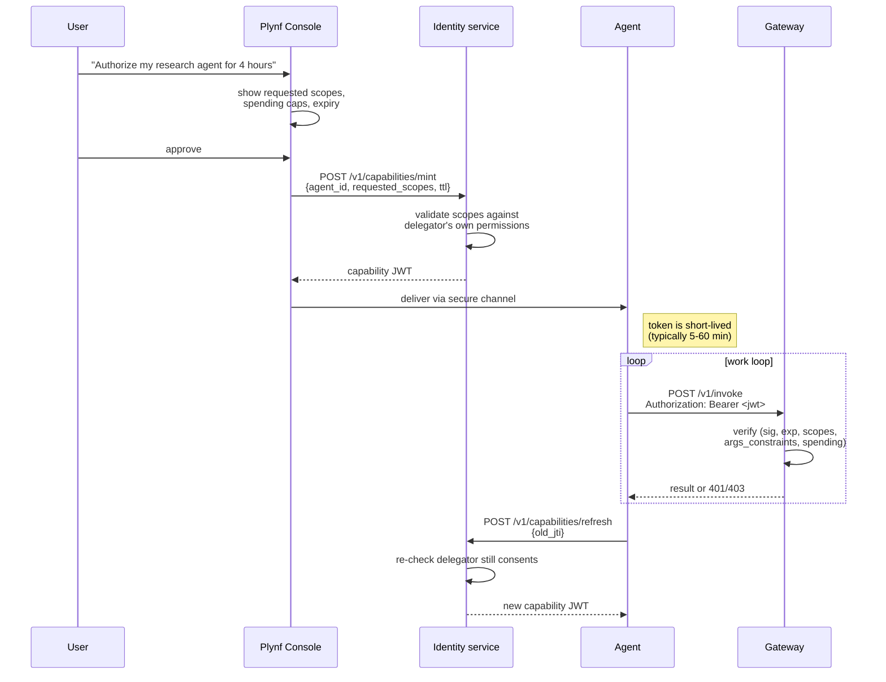
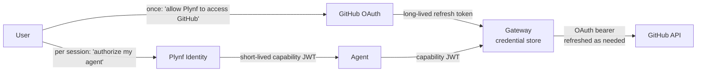

# 06 — Identity & Capabilities (v0.2 sketch)

> **Why this exists.** v0.1 accepts any non-empty bearer token. That works for a single developer on their laptop and works for absolutely nothing else. This document specifies the identity model we will adopt in v0.2: **agent-scoped capability tokens** rather than user-impersonation. It covers token format, issuance flow, gateway verification, revocation, and the relationship to the OAuth credentials the gateway holds for each backend tool.

## 1. The fork in the road: who is the principal?

Conventional auth assumes the principal is a *human user*. Their session token authorizes them to act, and the agent borrows that token (impersonates the user) when it does work on their behalf. This pattern has crippling problems for agents:

- **Blast radius.** A user token typically grants the user's full set of permissions. An agent given that token can do anything the user can do, including things the user did not intend (drain a bank account, delete a repo).
- **Auditability.** Every action looks like the user did it. "Did the user click this?" and "did the agent click this?" become indistinguishable.
- **Lifecycle.** User tokens expire on the human's session. Agents run on their own clocks and need their own lifecycle.
- **Consent.** "Can my agent do X for the next hour?" has no good representation in user-centric auth. You either give the agent everything or restart the consent dialog every time.

The alternative — and our position — is to treat the **agent as a first-class principal** with its own identity and a **capability token that explicitly enumerates what it may do**.

## 2. Capability token format

A capability token is a short-lived, signed JWT with the following claims:

```json
{
  "iss":  "https://identity.plinth.example/",
  "sub":  "agt_01HZQR4...",                  // the agent's stable ID
  "aud":  "https://gateway.plinth.example/",
  "exp":  1746450000,                         // Unix seconds
  "iat":  1746446400,
  "nbf":  1746446400,
  "jti":  "cap_01HZQR4...",                   // unique token ID, for revocation
  "plinth": {
    "delegator": {
      "kind": "user" | "service" | "agent",
      "id":   "usr_..."                       // who consented to this agent's powers
    },
    "workspace_scopes": [
      {"workspace_id": "ws_research_2026", "rights": ["read", "write", "snapshot"]}
    ],
    "tool_scopes": [
      {"tool_id": "web.fetch",  "rights": ["invoke"], "args_constraints": null},
      {"tool_id": "web.search", "rights": ["invoke"], "args_constraints": {"k": {"max": 10}}},
      {"tool_id": "fs.write",   "rights": ["invoke"], "args_constraints": {"path": {"prefix": "drafts/"}}}
    ],
    "channel_scopes": [
      {"name": "phase-1-complete", "rights": ["send", "recv"]}
    ],
    "lock_scopes": [
      {"resource_prefix": "workspace:ws_research_2026:*", "rights": ["acquire", "release"]}
    ],
    "spending_cap_usd_per_hour": 5.00,
    "spending_cap_usd_total":    50.00
  }
}
```

A few principles in this layout:

- **Explicit, not implicit.** Every action surface (workspace, tool, channel, lock) has a scope list. No "admin role" wildcards in v0.2 — those come at v1.0 once we trust the rest.
- **Args constraints are first-class.** A tool-level grant can say "only `fs.write` to paths under `drafts/`" or "only `web.search` with `k <= 10`". The gateway enforces these, not the SDK.
- **Spending caps are claims.** Two caps: per-hour rate and total budget. The gateway tracks spend in the event stream (arch doc 05 §6) and refuses calls that would exceed.
- **`delegator` records who consented.** Every agent token has a chain of trust ending at a human (or, for system agents, at a service principal). Audit can answer "who authorized this".

### Why JWT specifically

JWTs are widely understood, libraries exist in every language, the signature lets the gateway verify without calling back to the issuer, and the claim model fits ours. The downsides — JWT footguns around alg confusion, expiration handling, opaque token rotation — are well-documented and we mitigate them at the verifier (§5).

We considered Macaroons (lovely model, immature ecosystem), opaque session tokens with introspection (every request hits the issuer, undesirable for hot-path tool calls), and SPIFFE/SPIRE (workload identity, not designed for the kind of fine-grained scopes we need on top). JWT wins on pragmatism.

## 3. Issuance flow



A few notes on this flow:

- **The agent never touches OAuth.** The gateway holds the OAuth refresh tokens for tool backends (§7). The capability token only authorizes the agent against the gateway.
- **TTL is short by design.** Default 15 minutes, max 4 hours. Long-running agents refresh (§4). Stolen tokens have a small window of utility.
- **Scopes can only narrow.** A delegator with read-only access to a workspace cannot mint an agent token with write rights. The Identity service enforces.
- **One agent, many capabilities.** An agent can hold multiple capability tokens for different workspaces / tools, presented contextually. The gateway pays attention to whichever one the request used.

## 4. Refresh

A "refresh" mints a new capability JWT with the same scopes but a new `exp`. The Identity service may:

- Reduce scopes (the delegator's permissions changed)
- Refuse entirely (the delegator revoked, or hit a time limit)
- Issue with reduced TTL (approaching a hard cap)

Refresh is a fresh consent re-check, not a free renewal. Agents that lose refresh access have to escalate to the delegator. This is intentional friction: we don't want a stolen refresh path to mean "agent runs forever".

## 5. Verification at the gateway

The gateway is the *only* enforcement point for capability tokens (workspace service trusts the gateway's stamp via internal mTLS or shared secret in the v0.2 inter-service hop). Verification is on every request and consists of:

```python
# pseudocode for gateway middleware
def verify_capability(token: str, request: InvokeRequest) -> Principal:
    jwt = decode(token, key=identity_pubkey, algorithms=["EdDSA"])  # alg pinned!
    if jwt["aud"] != GATEWAY_URL:                       raise 401
    if not (jwt["nbf"] <= now() <= jwt["exp"]):         raise 401
    if jwt["jti"] in revocation_cache:                  raise 401

    # scope check
    tool_scope = find(jwt["plinth"]["tool_scopes"], request.tool_id)
    if not tool_scope or "invoke" not in tool_scope["rights"]:
        raise 403  # INSUFFICIENT_SCOPES

    if not args_satisfy_constraints(request.arguments, tool_scope["args_constraints"]):
        raise 403  # ARGS_CONSTRAINT_VIOLATED

    # spending check
    if budget_exceeded(jwt["sub"], jwt["plinth"]["spending_cap_usd_per_hour"]):
        raise 403  # SPENDING_CAP_EXCEEDED

    return Principal(agent_id=jwt["sub"], jti=jwt["jti"], scopes=jwt["plinth"])
```

Defense-in-depth notes:

- **`alg` is pinned.** Never `alg: none`, never accept HS256 if RS256/EdDSA is configured. Standard JWT advice; we enforce in the library config.
- **Public key rotation.** Identity publishes a JWKS at a stable URL with a 5-minute cache TTL on the gateway. Old keys remain in the JWKS for one full token-TTL cycle after rotation so in-flight tokens stay valid.
- **Revocation cache** is consulted on every request. It's small: only the `jti`s of currently-revoked-and-not-yet-expired tokens. Backed by an in-memory map populated from a SQL table, with a pub/sub fan-out across gateway nodes once we cluster.
- **Spending check** queries the events table (arch doc 05) for "sum of `cost.estimate_usd` where `agent_id = sub` and `timestamp > now() - 1h`". This is a real cost (small per-request query); v1.0 maintains a denormalised counter to remove it from the hot path.

## 6. Revocation

Three revocation paths:

1. **Time-based.** `exp` claim. The default and most common.
2. **Explicit revoke.** `POST /v1/capabilities/{jti}/revoke` on the Identity service. Pushes `jti` into the revocation cache. Gateway sees within seconds.
3. **Cascade revoke.** Revoking an agent or a delegator revokes all capabilities issued to/by them. Useful for "this agent is compromised, kill everything".

We deliberately do **not** support partial revocation ("revoke this scope but keep others"). If you need to narrow, mint a new token. Mutable tokens are an enormous source of bugs in this space.

## 7. Relationship to OAuth — gateway holds the OAuth, agent holds the capability

This is the most important diagram in this document:



The user has done **two distinct consents**:

1. *Once*, the user authorized Plynf itself (via OAuth) to act on GitHub. The gateway holds the resulting refresh token.
2. *Per session*, the user authorized **their agent** to use specific tools through Plynf, with constraints. The Identity service mints a capability for that.

The agent never sees the GitHub credentials. The agent gets a token that says "can call `github.create_pr`" — and the gateway translates that into an actual GitHub OAuth call when the time comes.

This decoupling is the central value of the gateway being an auth boundary. It means:

- Users can revoke an agent's capability without revoking Plynf's OAuth grant.
- Plynf can rotate OAuth refresh tokens without re-consenting agents.
- The blast radius of a stolen agent token is bounded by its scopes, not by a user's full GitHub permissions.

## 8. Service-to-service identity

Inside Plynf, the workspace and gateway services need to authenticate to each other (workspace must trust that "this gateway request comes from the actual gateway"). For v0.2:

- **mTLS** with certificates issued by an internal CA managed by the deployment.
- A short-lived **internal JWT** signed by a service-account key, used when mTLS is impractical (e.g. behind a load balancer that terminates TLS).

These are *separate from* capability tokens. Capability tokens are user-facing (well, agent-facing); internal trust is handled by infra-grade auth.

## 9. What v0.1 ships (and the v0.2 transition)

v0.1 has:
- `Authorization: Bearer <anything>` accepted by both services.
- The `agent_id` field in `InvokeRequest` is purely informational, not verified.
- Tool credentials are stored unencrypted in `auth_config` JSON in `gateway.db`. This is a known shortcut for the PoC.

The v0.2 transition is roughly:

1. Stand up a minimal Identity service (FastAPI, signs JWTs with EdDSA, JWKS endpoint, SQL-backed revocation table).
2. Gateway adds verification middleware. Behind a feature flag for the transition.
3. SDK learns to fetch capabilities (in dev: from the local Identity; in prod: from a configurable endpoint).
4. Tool credentials in `gateway.db` get encrypted with a master key (envelope encryption with a KMS-backed root for v1.0).
5. The any-bearer-token path stays for one minor version with a loud deprecation warning, then is removed.

## 10. Open questions / future directions

- **Capability constraint language.** `args_constraints` is JSON-schema-shaped today (`{"path": {"prefix": "drafts/"}}`). For richer cases (rate limits per arg, content filters), we may need a proper expression DSL — Cedar / Rego / a Plynf-specific subset. This is the policy-engine work in v0.5.
- **User-facing consent UI.** Showing a human "your agent wants to: write to fs.write paths under drafts/, send up to $5/hour, expire in 4 hours" is a UX problem with security teeth. We sketch the API; the UI is v0.5 work.
- **Cross-tenant capability tokens.** Can an agent in tenant A invoke a tool in tenant B? Default: no. Explicit cross-grants are a v1.0 enterprise feature.
- **Hardware-backed agent identity.** An agent's `agent_id` is, today, just an opaque string. For very high trust use cases, we may bind it to an attested hardware key (TPM, Nitro, SEV-SNP). Far future.
- **Replay-resistant tokens.** A capability JWT replayed from a logged HTTP request is valid until expiry. Mitigations: very short TTL, mTLS-bound tokens (DPoP-style), or audience-restricted tokens. We commit to short TTL in v0.2 and revisit if needed.
- **Delegation chains.** An agent issuing capabilities to sub-agents. Easy to design, hard to bound the blast radius. We're not doing this in v0.2 — the model is "capabilities flow from humans through Identity, not from agents to agents".

For why we centralise OAuth at the gateway, see arch doc 03 §5. For how capabilities interact with multi-tenant deployments, see ADR 0006. For how every request's `actor.agent_id` ends up in the event log, see arch doc 05.
