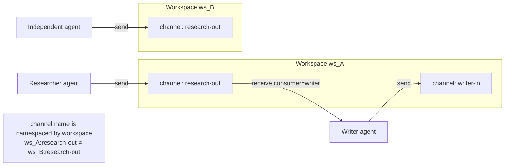

# 07 — Channels Design

> **Why this exists.** The moment Plynf grows past one agent, agents need a way to hand off work to one another that isn't "stuff a JSON blob in KV and hope the next agent polls". v0.2 ships **channels** — a workspace-scoped, durable, ordered message queue inside the workspace service. This document covers the implemented design, the deliberate omissions, and the path to a production-grade event substrate. The implementation lives at `services/workspace/src/plinth_workspace/channels.py`; the API surface is `CONTRACTS.md` §Channels.

## 1. Mental model

A channel is **a named, append-only log inside a workspace**. One agent sends, one agent (typically) receives, and the messages persist until they are acked or the workspace is deleted. Think of it as a SQS queue scoped to a single agent task — same shape, none of the operational footprint, plus replay because we don't delete on read by default.

The four facts that define v0.2 channel semantics:

1. **Workspace-scoped.** A channel `research-out` in workspace `ws_A` is unrelated to a channel of the same name in `ws_B`. There is no cross-workspace channel. Sharing requires explicit cross-workspace plumbing the agent owns.
2. **Lazy creation.** Sending to a channel that doesn't exist creates the row. Receiving from a channel that has never been sent to returns 404. This asymmetry is intentional (§4).
3. **Per-channel monotonic sequence.** Every message gets a `seq` that is `MAX(seq)+1` for that channel. Ordering is FIFO within a channel; there is no global cross-channel ordering.
4. **Single-consumer cursor model.** Channels are queues, not pub/sub topics. The first agent to drain a message is the one who got it. Multiple consumer names track *independent* cursors over the *same* log, but ack semantics are still "this consumer has caught up to seq N".



## 2. Why per-workspace, not global

The simplest alternative is a global channel namespace ("anyone can subscribe to `research-out`"). We rejected it for three reasons:

- **Audit boundary.** A workspace is the unit of agent state and audit. Tying channels to that boundary makes "show me everything that happened in this task" a one-shot query: filter by `workspace_id`. A global namespace would make it a join across services.
- **Deletion semantics.** Deleting a workspace deletes its channels. With a global namespace, channels would outlive the agent task that created them — and become unowned.
- **Multi-tenancy posture.** Per ADR 0006, isolation is workspace-shaped at v0.2 and tenant-shaped at v1.0. A workspace-scoped channel inherits both isolation properties without further work.

The cost is occasional duplication: two parallel research tasks each have their own `research-out`, even if they're conceptually the same flavour of message. We think that's correct — they're different runs, different audit trails, different lifecycles.

## 3. The data model

```sql
-- in workspace.db, abbreviated from services/workspace/src/plinth_workspace/db.py
CREATE TABLE channels (
    workspace_id     TEXT NOT NULL,
    name             TEXT NOT NULL,
    created_at       TEXT NOT NULL,
    last_send_at     TEXT,
    last_receive_at  TEXT,
    PRIMARY KEY (workspace_id, name)
);

CREATE TABLE channel_messages (
    id               TEXT PRIMARY KEY,        -- msg_<ulid>
    workspace_id     TEXT NOT NULL,
    channel          TEXT NOT NULL,
    seq              INTEGER NOT NULL,
    payload_json     TEXT NOT NULL,
    sender           TEXT,
    type             TEXT,
    correlation_id   TEXT,
    headers_json     TEXT NOT NULL,
    sent_at          TEXT NOT NULL,
    delivered_at     TEXT,
    UNIQUE (workspace_id, channel, seq)
);
CREATE INDEX channel_messages_by_seq
    ON channel_messages(workspace_id, channel, seq);

CREATE TABLE channel_cursors (
    workspace_id  TEXT NOT NULL,
    channel       TEXT NOT NULL,
    consumer      TEXT NOT NULL,
    last_seq      INTEGER NOT NULL,
    updated_at    TEXT NOT NULL,
    PRIMARY KEY (workspace_id, channel, consumer)
);
```

Three tables, no joins on the hot path. Send is `INSERT … RETURNING`, receive is `SELECT … ORDER BY seq LIMIT N`, ack is `UPDATE … SET delivered_at` plus an optional cursor advance. SQLite's WAL mode handles concurrent readers cleanly; the single writer is fine for v0.2 throughput targets (see §10).

### Sequence allocation

The implementation reads `SELECT COALESCE(MAX(seq), 0) + 1 FROM channel_messages WHERE workspace_id = ? AND channel = ?` inside the same transaction as the `INSERT`. SQLite's per-database write lock guarantees that two concurrent senders cannot both observe the same `MAX(seq)` and produce duplicate sequences. The cost: at most one sender at a time per workspace gets to write. Within a workspace, that's the right trade — you don't need parallel sends to a research-out channel; you need correctness.

For the curious: yes, we could use ULID directly as the ordering key and skip the sequence allocation. We chose explicit per-channel monotonic int because it makes "give me everything from seq=42" a clean integer comparison and lets clients reason about gaps. ULIDs *are* in there as `msg_id` for audit and idempotency.

## 4. Lazy creation, eager 404

`POST /channels/{name}/send` will create the channel row on first call; subsequent sends UPSERT `last_send_at`. `GET /channels/{name}/receive` returns 404 if the channel doesn't exist. The asymmetry is deliberate.

The producer's contract is "I'm asserting this channel exists; if it didn't, now it does." That fits how senders typically know what they're sending and don't want a separate `POST /channels` step.

The consumer's contract is "I'm waiting on a channel I expect to be there." If it's not, the much more common cause is *I typed the name wrong* than *the producer hasn't started yet*. A 404 surfaces the typo loudly. A silent empty result would mask it. Producers can race ahead of the consumer's startup — that's normal — but if you've called `receive` and got 404, you likely have a bug.

If a future use case needs "wait until the channel exists, then start receiving", that belongs in long-polling (§7), not in changing the create semantics.

## 5. Receive semantics

The endpoint `GET /channels/{name}/receive` accepts:

- `since=N` — return messages with `seq > N`. Default `since=0` (everything from the start).
- `consumer=<name>` — server tracks a per-consumer cursor (the highest seq this consumer has seen). On non-peek receives without explicit `since`, the cursor is the resume point and is advanced to the highest seq returned.
- `limit` — max messages, default 100, hard-capped at 1000.
- `peek=true` — read without advancing the cursor or marking `delivered_at`.

The combination handles three patterns:

| Pattern | Call | Behaviour |
|---|---|---|
| One-shot consumer | `?consumer=writer` | Resume from cursor; advance on read |
| Manual cursor management | `?since=42&limit=10` | Caller tracks the cursor; server doesn't advance |
| Read-only inspection | `?since=0&peek=true` | Replay everything, no side effects |
| Rewind a consumer | `?consumer=writer&since=0` | Explicit `since` overrides the cursor (one-time rewind) |

The default of "advance the cursor on read" rather than "advance on explicit ack" is the deliberate v0.2 simplification. It assumes the consumer can process the message synchronously inside the response window, which is fine for SDK-driven loops and not fine for long-running step logic. See §8 for what we lose and §9 for the v0.3 plan.

## 6. The producer + consumer flow

```mermaid
sequenceDiagram
    participant P as Producer (researcher agent)
    participant WS as Workspace svc
    participant DB as SQLite (workspace.db)
    participant C as Consumer (writer agent)

    P->>WS: POST /channels/research-out/send {payload}
    activate WS
    WS->>DB: INSERT INTO channels ON CONFLICT … (lazy create)
    WS->>DB: SELECT MAX(seq)+1 FOR channel
    WS->>DB: INSERT INTO channel_messages (seq, payload, …)
    DB-->>WS: msg_id, seq=7
    WS-->>P: 201 ChannelMessage{id, seq=7, ...}
    deactivate WS

    Note over C: Consumer polls / triggers
    C->>WS: GET /channels/research-out/receive?consumer=writer&limit=10
    activate WS
    WS->>DB: SELECT cursor.last_seq for (writer)
    WS->>DB: SELECT * FROM channel_messages WHERE seq > last_seq ORDER BY seq LIMIT 10
    DB-->>WS: [msg{seq=7,...}, …]
    WS->>DB: UPDATE delivered_at; UPSERT cursor.last_seq=7
    WS-->>C: 200 {messages: [...]}
    deactivate WS

    C->>C: process(msg)
    Note over C,WS: optional explicit ack/delete to free storage
    C->>WS: DELETE /channels/research-out/messages/{msg_id}
    WS->>DB: DELETE FROM channel_messages WHERE id = ?
    WS-->>C: 204
```

The DELETE-by-id is optional in v0.2. Cursors alone are enough to keep going forward. Explicit deletion is for callers who want to reclaim storage; the typical research → write → review pipeline can skip it and let workspace deletion clean up.

## 7. Long polling — the v0.3 sketch

In v0.2, `receive` is a synchronous read. If the queue is empty, you get an empty list and you poll again. That works at human-scale cadence (a writer waking up every 30s) and is wasteful at agent-scale cadence (a coordinator polling 5×/sec across 20 channels).

The v0.3 plan: a `wait_seconds=N` query parameter (max 30) that holds the connection open until either (a) a message arrives, (b) the timeout elapses, or (c) the client disconnects. Implementation options under consideration:

- **In-process condition variable.** A per-(workspace, channel) `asyncio.Event` notified on each send. Cheap, single-process only. Fine until we go multi-replica.
- **SQLite polling on the server side.** Sleep 100ms, re-query, repeat until the deadline. Simple, lossy on latency but works across replicas with no extra dependency.
- **Postgres LISTEN/NOTIFY at v1.0.** Once we move to Postgres per ADR 0002, channels can `NOTIFY` on send and `LISTEN` on the receive path, giving multi-replica long-poll for free.

We deliberately did not ship long-poll in v0.2 because the substrate decisions (asyncio.Event vs LISTEN/NOTIFY) depend on whether v0.3 stays single-replica or not. Holding the option open is the right move.

## 8. Backpressure: nothing yet

v0.2 has **no backpressure on sends.** A producer can fill SQLite if its consumer never drains. This is a deliberate omission for the PoC, not an oversight, but it is a hazard worth calling out.

What we plan for v0.3:

- **Per-channel `max_depth`.** Configurable on channel create (default unlimited). Sends to a full channel return 429 with a retry-after estimate.
- **Drop policies.** Optional per-channel: `block` (default; reject sends), `drop_oldest` (delete the lowest-seq message), `drop_newest` (silently drop the new send and 200 with a "dropped" flag). The drop policies are valuable for telemetry-shaped channels where the recent state matters more than every event.
- **Producer-side circuit breaker in the SDK.** If the SDK observes repeated 429 backpressure on a channel, it can short-circuit the next send rather than burning a network round-trip.

For v0.2 the only safety valve is operator-level: the dashboard surfaces channel `message_count` (current depth), and an operator can `DELETE /channels/{name}` to reset.

## 9. Failure modes

| Scenario | Current v0.2 behaviour | What we want for v0.3 |
|---|---|---|
| Receiver crashes after `receive` but before processing the message | The cursor has already advanced; `delivered_at` is set. The message appears delivered. **No redelivery.** Receiver loses the message. | Visibility-timeout model: receive marks `in_flight_until = now + T`; if the receiver doesn't ack within T, the message becomes redeliverable. |
| Receiver crashes mid-batch | Same as above, but for every message in the returned batch. | Same fix — visibility timeout per message in the batch. |
| Producer crashes mid-send | The `INSERT` either committed (consumer sees it) or didn't (consumer doesn't). No partial state. | Same — this is correct at v0.2. |
| Consumer reads, the workspace is then deleted | Workspace deletion cascades to channels and messages; the in-flight read response is still valid for the caller, but subsequent reads 404. | Same — workspace lifecycle is the outer truth. |
| Two consumers with the same name | Last write wins on the cursor. They'll race on every receive and skip messages each other read. | Document that consumer names should be unique per role; v0.3 may add an optional lease on the cursor. |
| `correlation_id` reuse | Allowed; correlation IDs are caller-defined and not enforced as unique. | No change — uniqueness is the caller's problem. |

The receiver-crash case is the most painful gap. Mitigations available in v0.2:

- The SDK exposes an optional `peek=true` receive followed by an explicit `DELETE /messages/{id}` after processing. This effectively gives at-least-once semantics inside the SDK, at the cost of a second HTTP round-trip per message.
- Workflows (arch doc 08) snapshot before each step. If the workflow's "process message N" step crashed, the workspace's snapshot history can be used to detect that the message was consumed but not acted on.

These are workarounds. The right answer is the visibility-timeout machinery. We commit to shipping it in v0.3.

## 10. Throughput, scale, and where this stops working

The v0.2 implementation is **bound by SQLite's single-writer constraint**. A workspace-level write throughput of roughly 1k–5k messages/sec is realistic on commodity hardware with WAL mode; that's the same order of magnitude as the workspace's KV write throughput (you're competing for the same write lock).

For agent coordination workloads — where messages are coarse-grained ("research phase complete", "draft ready for review") rather than fine-grained telemetry — that's wildly more headroom than we need. A research agent that emits 10 events per phase across 5 phases of a 30-minute task generates roughly one message per minute.

Where this design stops being plausible:

1. **High-throughput telemetry.** A channel emitting 1k events/sec from a fleet agent will saturate SQLite quickly. Don't use channels for this — use the observability event stream (arch doc 05).
2. **Cross-workspace fan-out.** v0.2 has no fan-out. If you need pub/sub semantics with multiple subscribers across workspaces, you don't have it.
3. **Multi-replica workspace.** Once we shard workspaces across replicas, the per-workspace SQLite single-writer model breaks. ADR 0007 covers the migration path: swap the channel implementation for a real broker (NATS JetStream is the leading candidate) while keeping the API surface unchanged.

This is honest sizing. The v0.2 channel is exactly enough for the use case it serves: durable, ordered, low-volume hand-offs between named agents inside the same workspace.

## 11. Comparison to alternatives

| Alternative | Fit for v0.2 | Why we didn't pick it |
|---|---|---|
| **Redis Streams** | Excellent fit semantically — consumer groups, ack, pending lists. | Adds Redis as a runtime dependency. We don't have Redis yet (workspace + gateway are SQLite-only at v0.2). |
| **NATS JetStream** | Production-grade durable pub/sub with replay. | Same dependency cost, plus an additional process to operate. Best target for the v0.3 swap. |
| **Kafka** | Industrial-strength. | Wildly oversized for v0.2 throughput. Rejected without serious consideration. |
| **Temporal signals** | Channels-as-workflow-signals would unify with workflows (arch doc 08). | Per ADR 0008, we don't use Temporal in v0.2. Signals would also overload Temporal's signal model with non-workflow traffic. |
| **Polling KV with a "messages" prefix** | Zero new code. | KV has no ordering guarantees, no cursor model, no cleanup story. We tried sketching it; the result was a worse channel. |

ADR 0007 covers the decision in detail.

## 12. Open questions / future directions

- **Subscription/fan-out.** A channel with N consumers each reading the full log. Today, two consumer names share the log but compete for cursor advancement. True fan-out (each consumer's cursor is independent of every other consumer's cursor) is a small change — the cursor table already keys on `(channel, consumer)`. The semantics question is whether fan-out is the default or opt-in.
- **Schema validation.** The original v0.1 sketch (arch doc 04 §2) proposed JSON-Schema-validated payloads. v0.2 ships untyped payloads (`payload: Any`). We may revisit if real customers tell us they want it; for the SDK-first audience, Pydantic models on the producer/consumer side cover the same ground.
- **Cross-channel transactions.** "Send on channel A *and* update KV `state` atomically." Today these are two HTTP calls and not atomic. A small `POST /channels/.../send-with-kv` shim is plausible if the use case shows up.
- **Encryption at rest for sensitive payloads.** Channel messages are stored as plain JSON in SQLite. The same applies to KV, but channels often carry tool outputs (potentially with PII). At v0.4, payload-level encryption with key material from the identity service (arch doc 06) is the right shape.
- **Replay completeness.** The `seq=0` replay returns every message ever sent (until explicit DELETE). Is that the right default for `peek=true` or should we have a retention window? We argue for "no retention by default; explicit DELETE for cleanup", but this is a question that deserves operator feedback.

For the v0.1 forward-looking sketch this document supersedes, see [`04-coordination-primitives.md`](./04-coordination-primitives.md) §2. For why we didn't reach for Kafka/NATS/Redis at v0.2, see [`../adr/0007-channels-vs-pubsub.md`](../adr/0007-channels-vs-pubsub.md). For how channels compose with workflows, see [`08-workflows-design.md`](./08-workflows-design.md) §5.
