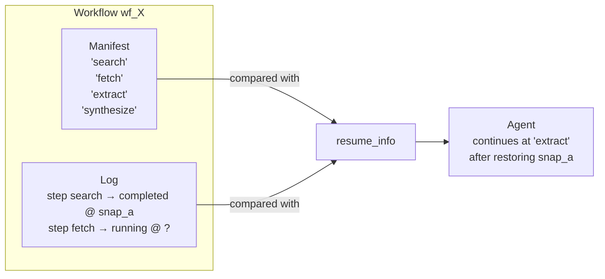
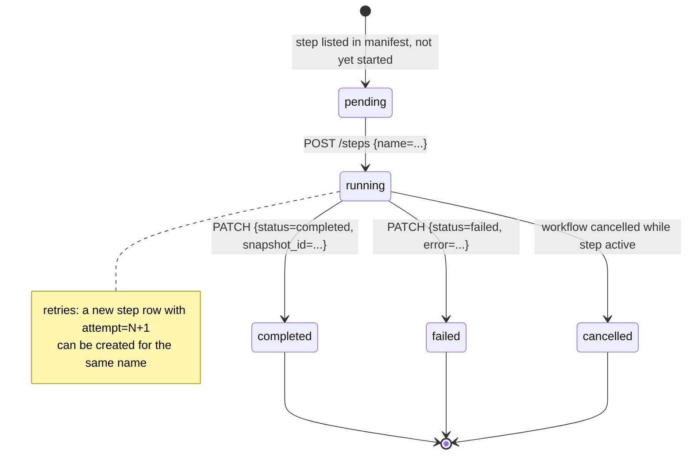

# 08 — Workflows Design

> **Why this exists.** Agents crash. The model rate-limits, the network blips, the host gets evicted. v0.2 ships **workflows** — a minimal, in-tree primitive that lets an agent declare a sequence of steps, log progress at each boundary, and resume from the last completed step after a restart. This document is the design spec for the implemented workflow primitive in `services/workspace/src/plinth_workspace/workflows.py`. It is deliberately *not* a Temporal replacement; ADR 0008 covers when we'd graduate to one.

## 1. Mental model

A v0.2 workflow is **a manifest plus a log**.

- The **manifest** is an ordered list of step names declared at workflow creation. It is the agent's plan.
- The **log** is a list of `WorkflowStep` rows that record what actually happened: when each step started, when it finished, what its output was, what error it produced, and which workspace snapshot it produced.
- **`resume_info()`** answers the only question that matters after a crash: "what's the next manifest entry I haven't completed, and what snapshot should I restore from?"

The manifest is declarative. The log is imperative. Together, they let a stateless agent process pick up exactly where it left off — by re-reading the manifest, the log, and the snapshot, and resuming the next step.



## 2. The state machine

Each step transitions through a small state space:



The workflow's overall status is **derived from the log**, not stored independently:

| Workflow status | Condition |
|---|---|
| `pending` | No step row exists yet |
| `running` | At least one step exists; not all manifest entries have `completed` rows |
| `completed` | Every manifest entry has at least one `completed` step |
| `failed` | At least one step is `failed` and the workflow has not recovered to `completed` (we treat failure as terminal in v0.2) |
| `cancelled` | `POST /workflows/{wf}/cancel` was called |

Derivation makes the API self-correcting: write a step, the workflow's status updates on the next read. There is no separate state-update path that could go out of sync with the log.

## 3. Why a manifest *and* a log

The simplest design is the log alone — agent does work, writes step rows, reads them back to resume. We added the manifest because of three problems the log-only model has:

- **What's left?** Without a manifest, "have I finished?" requires the agent to know its own plan. With one, it's a set difference: `manifest \ {names of completed steps}`. The agent's plan can live in code, but it's nice for the API to share that knowledge.
- **What's next?** Step ordering matters. Two steps on the log don't tell you which should run third. A manifest gives you the ordering, externally.
- **Validation.** When an agent writes a step row, we validate `name in manifest`. That catches typos and prevents an agent from "running" a step the workflow wasn't supposed to have.

Two-part state (declarative plan + imperative log) is the same shape Kubernetes uses for spec/status. The dynamics are different — workflow steps are mostly imperative — but the separation of "what was declared" from "what happened" pays dividends for the same reason it does for k8s: it makes the system inspectable.

A trade-off: the manifest is fixed at create time. A workflow that needs to add steps mid-execution can't. The honest answer is that v0.2 doesn't support dynamic plans; the agent must either (a) declare a long-enough manifest up-front, or (b) start a fresh workflow when the plan changes. Workflow composition (a workflow that spawns child workflows) is a v0.3+ topic.

## 4. The data model

```sql
-- in workspace.db, abbreviated from services/workspace/src/plinth_workspace/db.py
CREATE TABLE workflows (
    id                  TEXT PRIMARY KEY,
    workspace_id        TEXT NOT NULL,
    name                TEXT NOT NULL,
    steps_manifest_json TEXT NOT NULL,
    status              TEXT NOT NULL,       -- materialised but recomputed on read
    metadata_json       TEXT NOT NULL,
    created_at          TEXT NOT NULL,
    started_at          TEXT,
    finished_at         TEXT
);

CREATE TABLE workflow_steps (
    id           TEXT PRIMARY KEY,           -- step_<ulid>
    workflow_id  TEXT NOT NULL,
    name         TEXT NOT NULL,
    status       TEXT NOT NULL,
    attempt      INTEGER NOT NULL DEFAULT 1,
    started_at   TEXT,
    finished_at  TEXT,
    input_json   TEXT,
    output_json  TEXT,
    error        TEXT,
    snapshot_id  TEXT,                       -- references workspace snapshot
    created_at   TEXT NOT NULL
);
CREATE INDEX workflow_steps_by_workflow
    ON workflow_steps(workflow_id, started_at);
```

Two tables. No engine, no scheduler, no worker — the agent itself drives execution and the workspace service is purely the durable log.

## 5. Snapshots are the resume point

Per arch doc 02, a workspace snapshot is **a metadata record that captures the latest version of every key and every path at the moment of capture**. Snapshots are cheap (O(unique-keys) in size, milliseconds to take). That cheapness is what makes them workable as workflow checkpoints.

The protocol is straightforward:

1. Agent starts step `search` with `POST /workflows/{wf}/steps {name: "search", input: ...}`. Server creates a `running` row.
2. Agent does work. State mutates: KV writes, file writes, tool invocations.
3. Agent calls `ws.snapshot("after-search")` to capture state at the boundary. Returns `snap_<ulid>`.
4. Agent calls `PATCH /workflows/{wf}/steps/{step_id} {status: "completed", output: ..., snapshot_id: snap_<ulid>}`.

Now the step row contains a stable reference to the workspace state at the step boundary. After a crash:

1. Agent restarts. Calls `GET /workflows/{wf}/resume`.
2. Server returns `{next_step: "fetch", last_completed: <step row for "search">, snapshot_id: snap_<ulid>}`.
3. Agent decides how to "restore" from `snapshot_id` — typically by branching the workspace at that snapshot, or by reading values via the snapshot reference.
4. Agent starts step `fetch` and continues.

```mermaid
sequenceDiagram
    participant Agent
    participant WS as Workspace svc
    participant DB as workspace.db

    Agent->>WS: POST /workflows {name, steps:[search,fetch,extract]}
    WS->>DB: INSERT workflows
    WS-->>Agent: 201 Workflow{id=wf_X, status=pending}

    rect rgb(245,245,250)
    Note over Agent,WS: Step 1
    Agent->>WS: POST /workflows/wf_X/steps {name:search, input}
    WS->>DB: INSERT workflow_steps {status=running, attempt=1}
    WS-->>Agent: 201 WorkflowStep{id=step_a}
    Agent->>Agent: do work, mutate workspace
    Agent->>WS: POST /snapshots {name=after-search}
    WS-->>Agent: Snapshot{id=snap_a}
    Agent->>WS: PATCH /steps/step_a {status:completed, snapshot_id:snap_a, output}
    end

    rect rgb(255,240,240)
    Note over Agent: 💥 process crashes mid-step 'fetch'
    end

    rect rgb(245,250,245)
    Note over Agent,WS: Recovery
    Agent->>WS: GET /workflows/wf_X/resume
    WS->>DB: SELECT manifest; SELECT completed steps
    WS-->>Agent: ResumeInfo{next_step:fetch, snapshot_id:snap_a, last_completed:step_a}
    Agent->>Agent: restore from snap_a (branch / read pinned)
    Agent->>WS: POST /workflows/wf_X/steps {name:fetch, input}
    Agent->>Agent: continue
    end
```

The agent owns the choice of how to "restore". Common patterns:

- **Branch from snapshot.** `client.workspace.branch("recover", from_snapshot=snap_a)`. The agent then operates on the branch. Wins if any forward progress before the crash should be discarded.
- **Read pinned.** Use `?version=N` reads against the snapshot's pinned versions for any state the next step needs. Wins if the agent needs to selectively re-read.
- **Trust the workspace as-is.** If the failed step didn't make destructive writes, the workspace's current state may already be correct. The snapshot reference is then only audit metadata.

The API takes no opinion on which pattern the agent uses. It hands you the snapshot ID and the next step name; you decide what "restore" means.

## 6. Per-step `attempt` counter for retries

Each `WorkflowStep` row has an `attempt` integer, default 1. Re-starting a step (sending another `POST /workflows/{wf}/steps {name: "fetch"}`) creates a *new row* with `attempt = max(attempt) + 1` for that name. The previous attempt's row remains, with whatever `status` it had (typically `failed`).

The choice to keep prior attempts as separate rows rather than mutating in place gives us two things for free:

- **Audit.** Every retry has its own start time, error, and (if it ran far enough) snapshot. "How many times did the agent retry step `fetch`, and what error did each one produce?" is a single query.
- **Observability.** A workflow with retries shows up clearly in the dashboard (arch doc 05 §2 v0.2 dashboard) without needing a separate retry log.

What we don't have: built-in retry policies. Plinth doesn't decide whether to retry. The agent's loop does. The Plinth workflow primitive logs the attempts; it doesn't schedule them. This is a deliberate design choice — see §8.

## 7. What we lose by rolling our own

ADR 0008 covers the choice in full. For the architectural impact, the v0.2 workflow primitive is missing several things a real workflow engine would give you:

- **No automatic retry policies.** Temporal lets you declare "retry up to 5x with exponential backoff and max 30s". v0.2's agent has to write that loop itself.
- **No durable timers.** "Wait 24 hours, then continue" requires the agent to be running 24 hours from now. Plinth has no scheduler.
- **No signals.** "Wait for a human approval, then continue" can be approximated with channels (arch doc 07) but isn't first-class.
- **No exact-once tool execution semantics.** The gateway has idempotency keys (arch doc 03), but the workflow doesn't bind to them automatically. The agent has to pass `idempotency_key=step_id` itself if it wants exact-once.
- **No determinism check.** Temporal enforces that workflow code is replay-deterministic; ours doesn't, because we don't replay code, we re-enter the agent at the next step.
- **No timeouts on running steps.** A step stays `running` until the agent transitions it. If the agent dies, the row sits there forever. (See §9.)

We accept all of this. The v0.2 promise is durable resume, not durable execution. Bigger workflows with all of the above belong on Temporal, and the API surface is shaped so that migration is a backend swap, not a client rewrite.

## 8. What we gain by rolling our own

- **Zero ops.** No Temporal cluster, no Cassandra, no separate worker fleet. The workflow is a couple of tables in `workspace.db`.
- **Zero new dependency.** Same dependency surface as the rest of v0.2.
- **Fits the existing storage layer.** The `snapshot_id` reference goes straight into the same DB the snapshots live in. No cross-system FK problem, no eventual consistency between two stores.
- **Easy to reason about.** A senior engineer can read `workflows.py` (≈500 lines) and have the whole primitive in their head in 20 minutes. That's not true of Temporal.
- **Migration-friendly API.** The `WorkflowDef`-shaped API (manifest of steps, log of attempts) maps one-to-one to Temporal's workflow + activities. When we graduate, the SDK surface stays.

The v0.2 workflow is an MVP, not a frontier. It is enough to make resume work for the agent loops we expect at this stage; it is not enough to be a coordination platform for thousands of concurrent multi-step jobs. We are honest about the line.

## 9. Failure modes

| Scenario | v0.2 behaviour | Mitigation / future |
|---|---|---|
| Agent crashes mid-step | The `running` row stays `running` forever. No automatic cleanup. | Operator can `PATCH` to `failed`. v0.3 wants step-level heartbeats and a TTL: a step that hasn't been heartbeat'd in N minutes is auto-marked `failed`. |
| Agent crashes between snapshot and PATCH | Snapshot exists; step is still `running` (or absent if it crashed earlier). On resume, the agent sees the step as not-completed and re-runs it. The earlier snapshot is orphaned but harmless (referenced by nothing; eligible for GC eventually). | Same — accept the retry. |
| Workflow created with bad manifest | The manifest is validated for non-empty, no-duplicate names at create time. Bad input → 400. | No change. |
| Step name not in manifest | `POST /steps` with an unknown name → 400 (`InvalidStepName`). | No change. |
| Two agents transition the same step concurrently | Last write wins on `PATCH`. The race is unlikely (workflows are single-agent in v0.2), but the API doesn't prevent it. | v0.3 may add a step-level lease (compose with locks from arch doc 04). |
| Snapshot referenced by step is deleted | The step's `snapshot_id` becomes a dangling reference. Snapshots aren't deleted in v0.2 (no GC), so this is theoretical for now. | When GC ships (arch doc 02 §6), workflow-referenced snapshots become roots. |
| Workflow deleted with running steps | Workflows are deleted at workspace teardown (cascade). Standalone workflow delete isn't exposed in v0.2. | No change planned for v0.2. |

The agent-crashes-mid-step problem is the most painful. Today, the only signal that a workflow is stuck is the dashboard showing a step in `running` for an unreasonable time. v0.3's heartbeat mechanism is what turns this into "step times out and becomes failed", which the agent's restart logic can then retry.

## 10. How channels and workflows compose

Channels (arch doc 07) and workflows are independent primitives. They compose without explicit integration:

- A workflow step can `send` on a channel as part of its work — e.g. "researcher's `synthesize` step sends `done` on `research-out`, the writer's workflow has its first step waiting on `research-out`."
- A workflow step can wait on a channel by polling `receive` — though without long-polling (arch doc 07 §7) this is wasteful.
- An agent's restart logic can use both: re-read the channel cursor for any in-flight messages, and call `resume_info()` for the next workflow step.

There is no `wait_on_channel` step kind in v0.2. A step is just a name; what it does is the agent's code. We didn't introduce step kinds because the v0.1 sketch (arch doc 04 §4) had them and we judged the simpler "name + log + snapshot" model to be more honest about what the primitive does. Step kinds belong on the durable execution engine, not on the resume log.

## 11. Open questions / future directions

- **Step-level heartbeats and TTLs.** The single biggest v0.3 improvement. Without it, "is this workflow stuck or just slow?" is unanswerable.
- **Sub-workflows.** A step that is itself a workflow. Useful for parallelism and for composing reusable sub-routines. The primitive doesn't have it; manually creating a child workflow row is the v0.2 workaround.
- **Step-level idempotency keys.** Plumb `step_id` automatically into the gateway's `idempotency_key` field on tool invocations made within a step. The gateway already supports keys; the SDK can wire them through.
- **Workflow-as-graph.** Today the manifest is a linear list. Real research pipelines have parallel fetch-many steps. A DAG manifest with explicit `depends_on` edges is the natural extension; we held off because every customer's first workflow is linear.
- **Replay determinism.** v0.2 doesn't do replay; the agent re-enters at the next step. If we ever want true replay (re-running the agent's code given the recorded inputs/outputs), we'd need to mark side-effect boundaries. That's where the Temporal model becomes appealing.
- **Cross-workspace workflows.** "Agent A in workspace W1 finishes; agent B in workspace W2 starts." Today, both agents share a workflow ID across workspaces only if the caller plumbs it. We may make workflow IDs queryable across workspaces if multi-agent dances become common.
- **Time to graduate to Temporal.** The trigger conditions — meaningful retry policies, durable timers, signals as a first-class API, multi-replica scaling — are spelled out in ADR 0008. We commit to revisiting at v0.5.

For the v0.1 forward-looking sketch this document supersedes, see [`04-coordination-primitives.md`](./04-coordination-primitives.md) §4. For why we didn't reach for Temporal at v0.2, see [`../adr/0008-workflow-engine-built-in.md`](../adr/0008-workflow-engine-built-in.md). For how channels compose, see [`07-channels-design.md`](./07-channels-design.md). For the snapshot mechanics workflows depend on, see [`02-workspace-design.md`](./02-workspace-design.md) §4.
