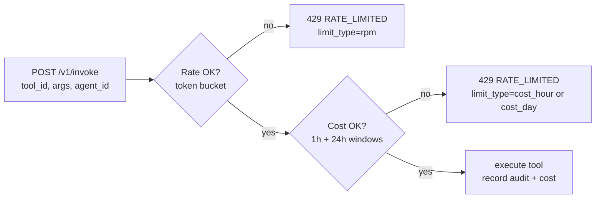

# 09 — Rate Limiting and Cost Caps Design

> **Why this exists.** A v0.1 gateway with no rate limit is one runaway agent away from a $10k cloud bill or a backend ban. v0.2 ships **rate limiting + cost caps** at the gateway: a token bucket per agent for request rate, plus a rolling-window cost ceiling per agent for dollars. This document covers the math, the implementation choices, the deliberate single-node simplification, and the path to a multi-replica deployment. Implementation lives at `services/gateway/src/plinth_gateway/limits.py`.

## 1. What we're protecting against

Three failure modes the v0.1 gateway has no defence against:

- **Runaway loops.** An agent in a retry storm hammering `web.fetch` 100×/sec. Bills compound, the backend rate-limits us, the audit log grows pathologically.
- **Stuck-cost loops.** A loop that *isn't* high-rate but each call is expensive (a deep-research tool charging $0.50/call). Low rate, high cost, same outcome.
- **Cross-agent contention.** One misbehaving agent saturates a shared backend so every other agent on the same gateway gets timeouts.

The v0.2 limits are scoped at the **agent** level (per `agent_id`). Agent identity is the right cardinality for both blame attribution (who burned the budget?) and isolation (one agent's quota is independent of another's). Workspace and tenant scoping is a v1.0 extension once multi-tenancy lands per ADR 0006.

## 2. The two dimensions

Rate (calls/minute) and cost (dollars/window) are independently checked. A request must pass *both* to proceed.



We deliberately do not collapse them into a single "budget" abstraction. They operate on different time horizons and respond to different signals: a token bucket controls *bursting*, a rolling window controls *cumulative spend*. An agent that has slowed down enough to pass the token bucket can still be cumulatively over budget for the day, and we want that to fail loudly.

## 3. Token bucket — the math

The implementation in `limits.py:TokenBucket` is the textbook token bucket:

- A bucket holds **at most `capacity` tokens**.
- Tokens **refill at `rate` tokens/second** up to capacity, never above.
- Each request consumes `n` tokens (default 1 — one token per `/v1/invoke`).
- If the bucket has ≥ n tokens at request time, consume them and pass.
- If not, reject and tell the caller `retry_after = (n - tokens) / rate`.

Mapped to the API contract (`PLINTH_RATE_LIMIT_DEFAULT_RPM=60`, `PLINTH_RATE_LIMIT_DEFAULT_BURST=20`):

- `capacity = 20` — burst tokens. The bucket starts full.
- `rate = 60 / 60 = 1.0` token/second.
- A fresh agent can issue 20 calls instantly, then 1 call/second sustained, with the burst pool re-filling whenever the agent goes quiet.

Refill is **lazy on each call**, not driven by a background timer:

```python
# from limits.py:TokenBucket._refill
now = self._time_fn()
elapsed = now - self.last_refill
if elapsed > 0:
    self.tokens = min(self.capacity, self.tokens + elapsed * self.rate)
    self.last_refill = now
```

Lazy refill is correct without any scheduler — the bucket math says "in T seconds you accumulate T*rate tokens, capped at capacity", and we just compute that on the next observation. The clock is `time.monotonic()` by default; tests inject a fake clock through `time_fn`. This is the same trick essentially every modern token-bucket implementation uses.

### The bucket retains state

`tokens` and `last_refill` live in the `TokenBucket` instance. The instance lives in `LimitsRegistry` keyed by `agent_id`. The registry lives in process memory.

That has two consequences:

1. **Restart drops the state.** A gateway restart resets every bucket to full. An agent that was throttled now gets a fresh burst. We accept this for v0.2 (you have to crash a gateway, which is rare; and the cost-cap dimension still enforces against the persisted audit log, so the "real" budget is intact).
2. **Multi-replica diverges.** Two gateway processes serving the same agent each have their own bucket. The effective rate is 2× the configured one. (See §6.)

## 4. Why token bucket, not the alternatives

The three contenders are token bucket, leaky bucket, and sliding window. ADR 0009 covers the decision; the architectural summary:

| Algorithm | Burst behaviour | Memory | Why we picked / didn't |
|---|---|---|---|
| **Token bucket** | Allows bursts up to `capacity`, then sustained at `rate`. | O(1) per agent (2 floats). | **Picked.** Agents have legitimate bursts at workflow startup (kicking off N parallel tool calls). Token bucket lets us say "yes, you can burst, but average down." |
| **Leaky bucket** | Smooths to a constant rate; bursts are discarded or queued. | O(1) per agent. | Rejected. Penalises legitimate workflow startup bursts. Right for traffic-shaping outbound rate to a backend, wrong for agent-friendly throttling. |
| **Sliding window** | Precise count of "calls in the last 60s". | O(window-size) per agent (one counter per second-bucket). | Rejected for v0.2. More precise but more memory; precision wasn't worth the cost given that "60 calls in any 60-second window" and "average 1/s with burst 20" are practically indistinguishable for our use case. |

The argument that decided it: **agents are bursty by design**. A workflow's "fan out fetch over 10 URLs" is a 10-call burst followed by silence. Penalising that pattern is wrong.

## 5. Cost caps — the rolling window

Rate alone doesn't catch the expensive-tool-low-rate case. The second dimension is a rolling-window cost ceiling.

Two windows enforced per agent:

- `cost_cap_usd_hour` — max dollars spent in the last 60 minutes (default $1.00).
- `cost_cap_usd_day` — max dollars spent in the last 24 hours (default $10.00).

The check is a SQL aggregate against the gateway's audit log:

```sql
-- per agent_id, on each /v1/invoke
SELECT COALESCE(SUM(cost_estimate_usd), 0)
FROM audit_events
WHERE agent_id = ?
  AND timestamp >= ?      -- now - 1 hour or now - 24 hours
  AND error IS NULL;      -- failed calls don't burn budget
```

Indexed on `(agent_id, timestamp DESC)` — this is the audit log's existing index, no new index needed. Query cost on a healthy audit table (millions of rows) is sub-millisecond at our scale.

### Cached calls don't count

`cost_estimate_usd = 0` for cache hits (per arch doc 03 §3). The SUM naturally ignores them because they sum to zero. This is exactly what we want — an agent that hits the cache 100× costs nothing real, and we shouldn't budget-throttle it.

### Failed calls don't count

The `error IS NULL` filter excludes failed invocations from the budget. The reasoning: a tool that errored is not the agent's "spend" — it's a wasted call, and rate-limiting them via budget would compound the agent's misery. The rate-bucket dimension still throttles them (failed calls do consume tokens), which is the right outcome: failures throttle for rate but not for budget.

### Window precision

A "rolling 1h window" is interpreted as `timestamp >= now - 60 minutes` at request time. Approximation, not bucketing — the window slides per-request. We're not pre-bucketing into hour windows because the cardinality of agents is small and the SQL is fast.

## 6. Why in-memory is fine for v0.2 — and not for v0.3

The bucket state is in process memory. The cost-cap state is in the SQL audit log. The rate dimension is therefore **per-replica**; the cost dimension is **shared across replicas** (because they all read the same audit DB).

For v0.2 single-node deployments, that's correct. For v0.3 multi-replica:

- **Cost caps stay correct** because the audit log is the source of truth.
- **Rate caps drift.** Two replicas each let an agent burst to 20 → effective burst 40. Two replicas each let it sustain 60 rpm → effective 120 rpm.

The v0.3 fix is **Redis-backed token buckets**:

- `INCR` + `EXPIRE` patterns for sliding-window approximations, or
- A Lua script doing the lazy-refill compute atomically, with `tokens` and `last_refill` in a hash.

We held off in v0.2 because we don't have Redis as a dependency yet (gateway is SQLite-only). Adding Redis just for rate limits is overkill while the deployment shape is single-node. Once v1.0 lands Redis for the cache layer (per arch doc 01 §2.2), reusing it for buckets is a 50-line change.

## 7. Per-agent overrides

Default limits come from environment variables:

```
PLINTH_RATE_LIMIT_DEFAULT_RPM      = 60
PLINTH_RATE_LIMIT_DEFAULT_BURST    = 20
PLINTH_COST_CAP_DEFAULT_USD_HOUR   = 1.0
PLINTH_COST_CAP_DEFAULT_USD_DAY    = 10.0
```

Per-agent overrides are stored in an `agent_limits` table:

```sql
CREATE TABLE agent_limits (
    agent_id            TEXT PRIMARY KEY,
    rpm                 INTEGER NOT NULL,
    burst               INTEGER NOT NULL,
    cost_cap_usd_hour   REAL    NOT NULL,
    cost_cap_usd_day    REAL    NOT NULL,
    updated_at          TEXT    NOT NULL
);
```

The lookup order on each `/v1/invoke`:

1. Look up `agent_limits` row for `agent_id`. If present, use its values.
2. Otherwise, fall back to the env-default values.

Either way, the in-memory `TokenBucket` for `agent_id` is constructed lazily on first use with whatever values are effective at construction time. Subsequent updates to the row through `POST /v1/limits/{agent_id}` invalidate and reconstruct the bucket so the new rate/capacity takes effect on the next call.

Endpoints:

```
POST   /v1/limits/{agent_id}         body: AgentLimits  → 200 AgentLimits
GET    /v1/limits/{agent_id}                            → 200 AgentLimits
DELETE /v1/limits/{agent_id}                            → 204   (revert to defaults)
GET    /v1/limits/{agent_id}/status                     → 200 LimitsStatus
```

The `/status` endpoint returns the current usage against limits — `rpm_used_in_window`, `cost_used_usd_hour`, `cost_used_usd_day`. Useful for the dashboard (arch doc 05 §2 v0.2 dashboard) and for the SDK to surface "you're at 80% of your hourly budget".

## 8. The 429 response anatomy

When either dimension fails, the gateway returns 429 with both an HTTP header and a structured body:

```http
HTTP/1.1 429 Too Many Requests
Retry-After: 12
Content-Type: application/json

{
  "error": {
    "code": "RATE_LIMITED",
    "message": "Rate limit exceeded for agent_id agt_X. Retry after 12s.",
    "details": {
      "limit_type": "rpm",
      "retry_after_seconds": 12,
      "current": 60,
      "limit": 60
    }
  }
}
```

The `Retry-After` header is the canonical way to communicate retry timing to clients (HTTP-aware retry libraries respect it). The structured body adds `limit_type` so callers can distinguish between rate and cost without parsing the message:

- `limit_type=rpm` — bucket empty; retry after the bucket has refilled enough.
- `limit_type=cost_hour` — over hourly cost cap; retry after the oldest hour-window cost falls off.
- `limit_type=cost_day` — over daily cost cap; retry after midnight (or whenever costs roll off).

The `retry_after_seconds` for cost-window 429s is a *lower bound* — it's the time until the oldest-relevant audit row falls out of the window, computed from `MIN(timestamp)` of the contributing events. For the rate dimension it's exact (the token bucket math gives us the answer to the second).

## 9. Edge cases and behaviours

| Case | Behaviour |
|---|---|
| Burst handling | First N calls (where N=burst) on a fresh bucket pass instantly. Subsequent calls throttle to `rate` per second. |
| Cached calls | Pass the rate dimension (consume a token), pass the cost dimension (cost=0). Cache hits do count toward rpm — they're cheap but not free; we still don't want infinite cache loops. |
| Failed calls | Pass / reject the rate dimension normally. Excluded from the cost dimension (per §5). |
| Missing `agent_id` on the request | Default agent identity (`anonymous`) gets one shared bucket. v0.2 is permissive; v1.0 will reject calls without agent identity. |
| Multi-process gateway (uvicorn workers) | Each worker has its own bucket. Effective limits are `rpm × workers`. Documented as a known v0.2 limitation; production deployments should run a single gateway worker until v0.3's shared-state implementation. |
| Cost estimate missing on tool result | We default `cost_estimate_usd=0` if the tool/proxy doesn't supply one. That means "free" by default, which is wrong for paid tools — see arch doc 05 §9 for the upstream cost-reporting work in MCP that fixes this. |
| Limits changed mid-request | The check happens before backend dispatch; once dispatched, the request completes regardless of a concurrent limits update. The next request sees the new limits. |
| Agent issues 1000 calls in parallel | All but the first 20 (= burst capacity) reject with 429 immediately. Caller's responsibility to back off; the SDK does not auto-retry. |

## 10. Scaling considerations

A summary of where this design fits and where it doesn't.

**Fits cleanly:**
- A single-node gateway serving up to a few hundred agents with rpm in the 10–10000 range. The token-bucket math is O(1) per request; the cost SQL is O(1) lookup with the existing audit index.
- A workload where bursts are common and "average rate over a minute" is the contract you want.
- Audit-log-as-source-of-truth for cost. As long as cost flows through audit (it does), the cost dimension is durable across restarts.

**Doesn't fit:**
- Multi-replica gateways without shared bucket state. Rates drift; you over-budget by a factor of the replica count.
- Sub-second rate limits. The token-bucket math handles fractional tokens, but lazy refill plus per-request locking introduces millisecond-scale jitter. For sub-second precision, a sliding window is the correct algorithm.
- Tens of thousands of agents on a single node. Bucket-per-agent is fine to ~10k agents in memory; beyond that, eviction matters and we'd want LRU on the registry.

**Migration path to v0.3:**
1. Move the `LimitsRegistry`'s bucket dictionary behind a Redis-backed implementation. The interface (`try_acquire`, `snapshot_tokens`) doesn't change.
2. Cost-cap SQL stays as-is until the audit log itself moves to a multi-replica store (Postgres per ADR 0002).
3. The 429 response shape doesn't change — clients written against v0.2 work unmodified against v0.3.

## 11. Open questions / future directions

- **Per-tool rate limits.** Today's bucket is per-agent. A tool with a tight upstream rate limit (a paid web-search at 10 rpm/key) needs a separate per-tool bucket. The model is the same, the dimension is different. Slated for v0.3.
- **Per-workspace caps.** Useful for "this research workspace gets max $5 of total spend". Easy as a third dimension on top of the existing two. Waiting on a real customer ask.
- **Adaptive limits.** Adjust the bucket rate based on observed backend errors — back off automatically when the upstream is rate-limiting us. Easy to over-engineer; deferred until we see the failure mode in production.
- **Soft-limit warnings.** A "you're at 80% of your daily budget" header on responses *before* the 429 lands. Pure UX win, easy to add, just hasn't been prioritised.
- **Cost prediction at dry-run.** The gateway already supports `/v1/invoke/dry-run` (arch doc 03). Combining that with the current cost window would let agents ask "if I made this call, would I bust my budget?" before committing. Plumbing exists; the SDK ergonomic is the missing piece.
- **Token-aware limits for model-call cost.** The same bucket model could throttle agent **model** spend if model calls flowed through a Plynf proxy. Today they don't (per arch doc 01 §1, model calls bypass Plynf). v0.4+ if/when we add a model-side gateway.

For the existing audit-log substrate this builds on, see [`03-tool-gateway-design.md`](./03-tool-gateway-design.md) §4. For why we chose token bucket over the alternatives, see [`../adr/0009-token-bucket-rate-limiting.md`](../adr/0009-token-bucket-rate-limiting.md). For the dashboard surfacing of `/v1/limits/{agent_id}/status`, see [`05-observability.md`](./05-observability.md) §2.
