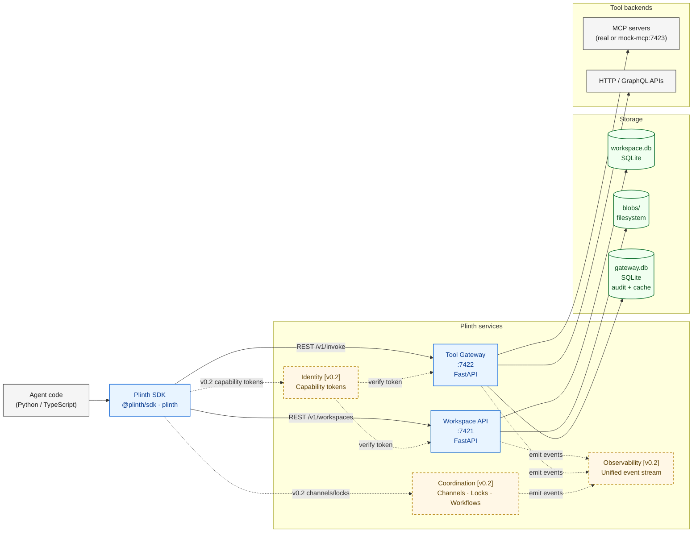

# Architecture overview

This diagram shows the runtime topology of Plinth at v0.1 plus the post-v0.1
extensions sketched in `ARCHITECTURE.md`. Solid boxes ship in v0.1; dashed
boxes are stubs scheduled for v0.2.

The Agent SDK is the only thing the agent code talks to directly. The SDK fans
out to the Workspace API for state and to the Tool Gateway for tool calls. The
two services share a data directory but no in-process state, so they can be
deployed independently.

## Component responsibilities

| Component | Status | Responsibility |
|-----------|--------|----------------|
| Agent SDK | v0.1 | Ergonomic client; hides REST details; powers `@client.agent` decorator. |
| Workspace API | v0.1 | Versioned KV, files, snapshots, branches, merge/diff. |
| Tool Gateway | v0.1 | Tool registry, invoke proxy, cache, idempotency, dry-run, audit log. |
| `mock-mcp` | v0.1 | Demo MCP server with offline fixtures (`web.fetch`, `web.search`, etc.). |
| Coordination | v0.2 | Channels, locks, durable workflows (Temporal-backed). |
| Observability | v0.2 | OTLP-compatible unified semantic event stream. |
| Identity | v0.2 | Capability-token issuance and verification. |
