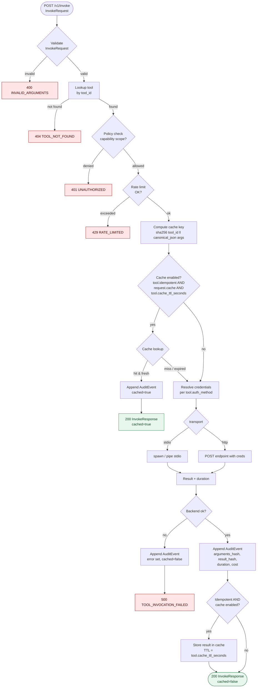

# Flow — tool invocation through the gateway

This flow shows what happens inside the Tool Gateway when an agent calls
`POST /v1/invoke`. It mirrors the request flow in `ARCHITECTURE.md` and is the
contract every backend (HTTP, MCP stdio, etc.) plugs into.

The gateway is the single auth boundary, single audit boundary and single
cache boundary for all tool calls. Anything that bypasses this flow forfeits
those properties.



## Cache key recipe

```
cache_key = sha256(
    utf8(tool_id) || 0x00 ||
    canonical_json(arguments)
)
```

`canonical_json` = JCS / RFC 8785 (sorted keys, no whitespace, normalised
numbers). This guarantees that semantically equal calls share a key.

## Audit event invariants

- Always emitted, including for cache hits and errors.
- `arguments_hash` and `result_hash` are SHA-256 over the canonical-JSON
  serialisations. The raw values are *not* persisted in the audit log.
- The audit row's `id` (`evt_<ulid>`) is returned to the caller as
  `InvokeResponse.audit_id` so SDKs can correlate logs.

## Dry-run difference

`POST /v1/invoke/dry-run` follows the same path through `CacheKey` and
`CacheLookup`, but returns `DryRunResponse` and never reaches the backend or
the audit append step.
