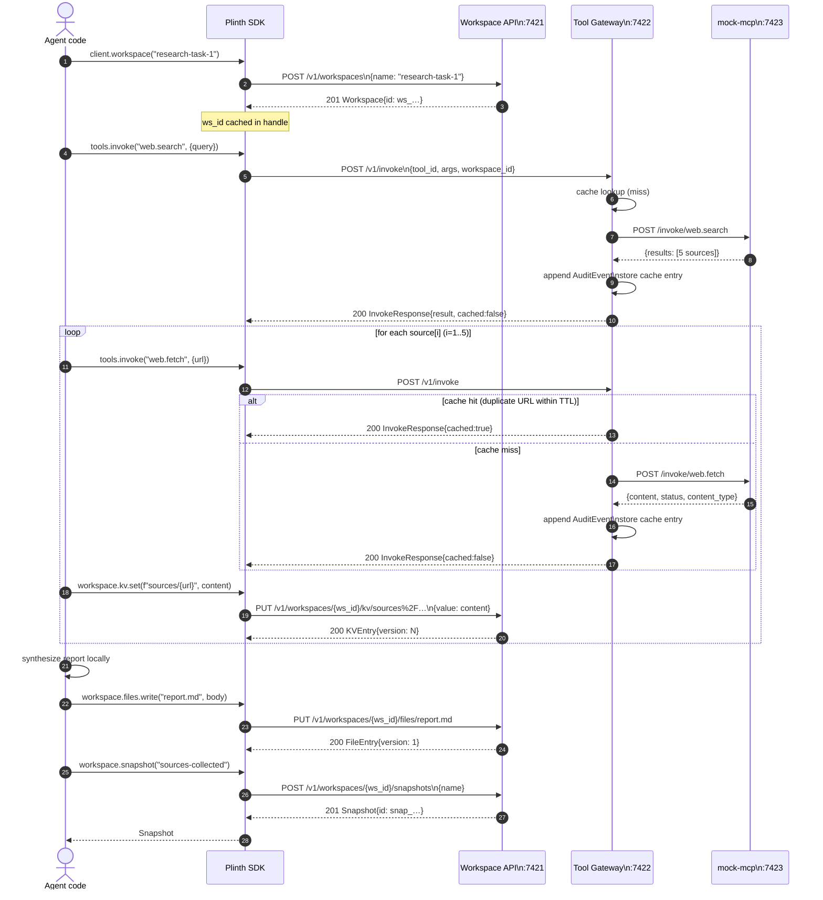

# Sequence — research agent demo

The reference demo (`examples/01-research-agent/`) uses every v0.1 primitive
end-to-end: it creates a workspace, searches the web (mocked), fetches each
result with caching, persists everything to KV and files, then snapshots the
result. This sequence shows how SDK calls translate to HTTP traffic against
the Workspace API and the Tool Gateway.

The first `web.fetch` for a given URL misses the cache and hits the upstream
mock MCP server. Subsequent identical fetches within the tool's
`cache_ttl_seconds` (default 300s) short-circuit at the gateway and never
touch the backend.

## Key invariants illustrated

- **Workspace handle is sticky.** All subsequent state ops carry `ws_id`.
- **Audit precedes cache write.** Even cached calls go through the audit log.
- **Workspace state is independent of the gateway.** A failed fetch leaves a
  consistent KV/file timeline that can be rolled back via snapshot.
