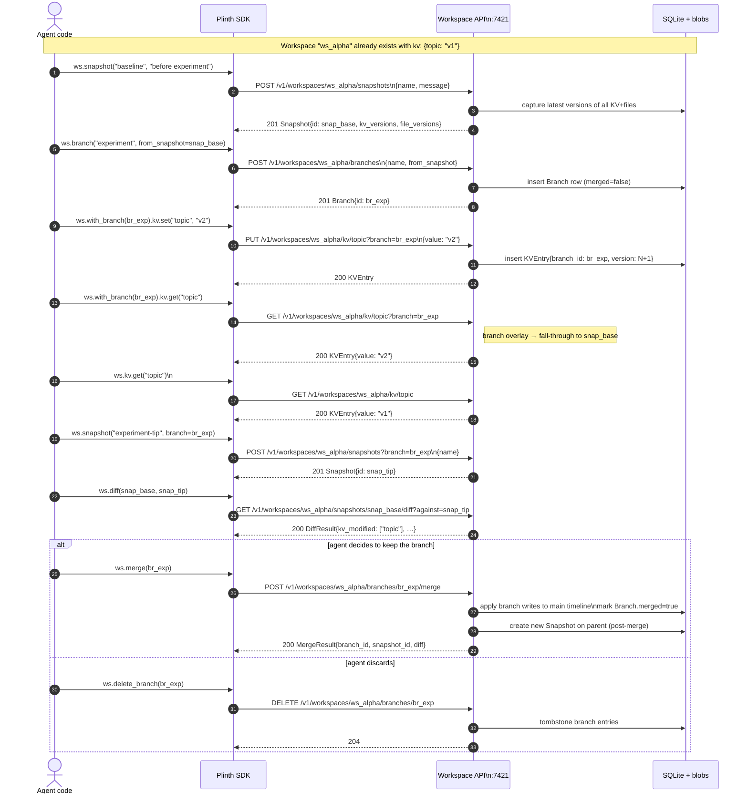

# Sequence — snapshot, branch, merge

This sequence shows the canonical "what-if" exploration pattern an agent uses
to try a risky mutation in isolation, decide whether the result is good, and
then either merge it back into the main timeline or discard it. All requests
hit the Workspace API at `:7421`.

Branch reads see *branch-specific writes first*, then fall through to the
source snapshot. Branch writes never affect the parent timeline until merge.

## Notes

- A snapshot is metadata only — it just records `{key → version}` and
  `{path → version}` for every entry already present.
- Merging produces a **new snapshot** on the parent timeline. The branch row
  is marked `merged=true` but kept for audit.
- Discard is non-destructive in v0.1 (we tombstone, not vacuum) so audit
  trails stay intact.
