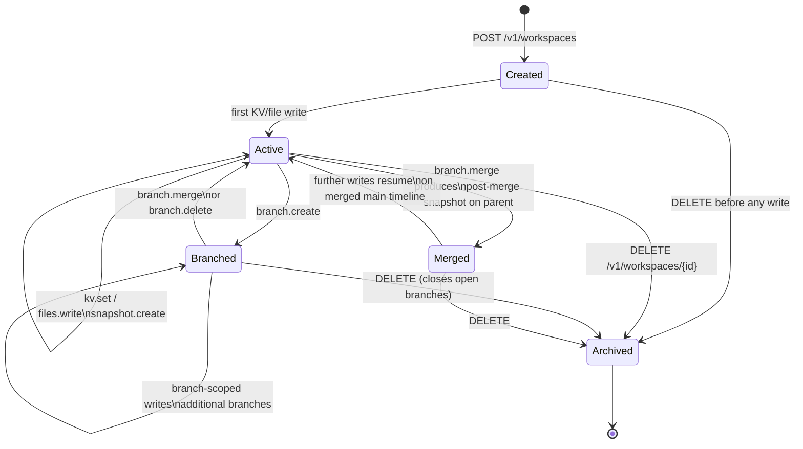

# State — workspace lifecycle

A workspace traverses a small set of states in v0.1. The diagram below makes
the implicit lifecycle explicit so SDK callers and operators have a shared
vocabulary.

`Created` is the moment after the `POST /v1/workspaces` returns 201. It
transitions immediately into `Active` once any first write lands. `Branched`
is a soft state — a workspace can be `Active` and have any number of open
branches at the same time; the diagram shows the dominant transition.

## State semantics

| State | Meaning | Visible via |
|-------|---------|-------------|
| `Created` | Row exists, no entries yet. | `GET /v1/workspaces/{id}` returns Workspace, `kv` and `files` lists are empty. |
| `Active` | At least one entry has been written or read. | Same as above with non-empty lists. |
| `Branched` | One or more open branches (`Branch.merged == false`). | `GET /v1/workspaces/{id}/branches` shows ≥ 1 unmerged branch. |
| `Merged` | A branch produced a post-merge snapshot on the parent timeline since the last write. | `parent_snapshot_id` chain in latest snapshot reflects merge lineage. |
| `Archived` | Workspace deleted; data tombstoned. | `GET /v1/workspaces/{id}` returns 404. |

The state machine is purely descriptive in v0.1 — no API surface enforces a
state transition guard beyond standard 404 / 409 semantics.
